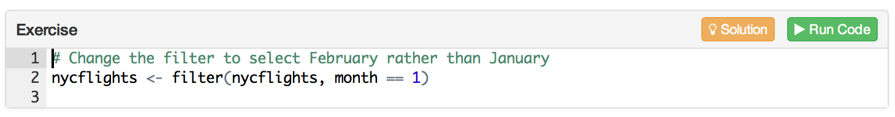

## Overview

The **tutor** package makes it easy to turn any [R Markdown](http://rmarkdown.rstudio.com) document into an interactive tutorial. Tutorials consists of content along with interactive components for checking and reinforcing understanding. Tutorials can include any or all of the following:

1. Narrative, figures, illustrations, and equations.

2. Videos (supported services include YouTube and Vimeo).

3. Code exercises (R code chunks that users can edit and execute directly).

4. Quiz questions.

5. Interactive Shiny applets.

To create a tutorial, just use `library(tutor)` within your Rmd file to activate tutorial mode, then use the `exercise = TRUE` attribute to turn code chunks into exercises. Users can edit and execute the R code and see the results right within their browser.

For example, here's a very simple tutorial:

    ---
    title: "Hello, Tutor!"
    output: html_document
    runtime: shiny_prerendered
    ---
    
    ```{r setup, include=FALSE}
    library(tutor)
    ```
    
    The following code computes the answer to 1+1. Change it so it computes 2 + 2:
    
    ```{r, exercise=TRUE}
    1 + 1
    ```
    
This is what the running tutorial document looks like after the user has entered their answer:

<kbd>

</kbd>    
    

We'll go through this example in more detail below. First though let's cover how to install and get started with the **tutor** package.


## Getting Started

### Installation

1. Install the development version of the **tutor** package from GitHub as follows:

    ```r
    devtools::install_github("rstudio/tutor", auth_token = "33cdbf9d899fe6eff5022e67e21f08964f7c7b19")
    ```

2. Install the current [RStudio Daily Build](https://dailies.rstudio.com) (v1.0.114 or higher) as it includes tools for easily running and previewing tutorials.

### Creating a Tutorial

A tutorial is just a standard R Markdown document that has three additional attributes:

1. Loads the **tutor** package.
2. Includes one or more interactive components (exercises, quiz questions, etc.).
3. Uses the `runtime: shiny_prerendered` directive in the YAML header.

The `runtime: shiny_prerendered` element included in the YAML hints at the underlying implementation of tutorials: they are simply Shiny applications which use an R Markdown document as their user-interface rather than the traditional `ui.R` file.

You can copy and paste the simple "Hello, Tutor!" example from above to get started creating your own tutorials.

### Running Tutorials

Tutorials are Shiny applications that are run using the `rmarkdown::run` function rather than the `shiny::runApp` function. For example:

```r
rmarkdown::run("tutorial.Rmd")
```

Assuming you've installed the **tutor** package you can run a live version of the "Hello, Tutor" example provided above with:

```r
rmarkdown::run(system.file("examples/hello.Rmd", package = "tutor"))
```

## Tutorial Exercises

There are some special considerations for code chunks with `exercise=TRUE` which are covered in more depth below.

### Exercise Evaluation

By default, exercise code chunks are NOT pre-evaluated (i.e there is no initial output displayed for them). However, in some cases you may want to show initial exercise output (especially for exercises like the ones above where the user is asked to modify code rather than write new code from scratch).

You can arrange for an exercise to be pre-evaluated (and it's output shown) using the `exercise.eval` chunk option. For example:

    ```{r, exercise=TRUE, exercise.eval=TRUE}
    # Change the filter to select February rather than January
    filter(nycflights, month == 1)
    ```
    
You can also set a global default for exercise evaluation using `knitr::opts_chunk` within your global setup chunk, for example:

    ```{r setup, include=FALSE}
    knitr::opts_chunk$set(exercise.eval = TRUE)
    ```

### Exercise Setup

Code chunks with `exercise=TRUE` are evaluated within standalone environments. This means that they don't have access to previous computations from within the document. This constraint is imposed so that users can execute exercises in any order (i.e. correct execution of one exercise never depends on completion of a prior exercise).

You can however arrange for setup code to be run before evaluation of an exercise to ensure that the environment is primed correctly. There are three ways to provide setup code for an exercise:

1. Add code to the global `setup` chunk. This code is run once at the startup of the tutorial and is shared by all exercises within the tutorial. For example:

        ```{r setup, include=FALSE}
        nycflights <- nycflights13::flights
        ```
    
        ```{r, exercise=TRUE}
        # Change the filter to select February rather than January
        filter(nycflights, month == 1)
        ```
    
        ```{r, exercise=TRUE}
        # Change the sort order to Ascending
        arrange(nycflights, desc(arr_delay))
        ```

2. Create a setup chunk that's shared by several exercises. If you don't want to rely on global setup but would rather create setup code that's used by only a handful of exercises you can use the `exercise.setup` chunk attribute to provide the label of another chunk that will perform setup tasks. To illustrate, we'll re-write the previous example to use a shared setup chunk named `flights-setup`:

        ```{r setup_flights}
        nycflights <- nycflights13::flights
        ```
        
        ```{r, exercise=TRUE, exercise.setup = "setup_flights"}
        # Change the filter to select February rather than January
        filter(nycflights, month == 1)
        ```
    
        ```{r, exercise=TRUE, exercise.setup = "setup_flights"}
        # Change the sort order to Ascending
        arrange(nycflights, desc(arr_delay))
        ```

3. Create a setup chunk that's specific to another chunk using a `-setup` chunk suffix. To do this give your exercise chunk a label (e.g. `exercise1`) then add another chunk with the same label plus a `-setup` suffix (e.g. `exercise1-setup`). For example:

        ```{r exercise1-setup}
        nycflights <- nycflights13::flights
        ```
        
        ```{r exercise1, exercise=TRUE}
        # Change the filter to select February rather than January
        nycflights <- filter(nycflights, month == 1)
        ```

### Exercise Solutions

You can optionally provide a solution for each exercise that can be optionally displayed by users. To do this simply create a new code chunk a `-solution` chunk label suffix. For example:

        ```{r exercise1, exercise=TRUE}
        # Change the filter to select February rather than January
        nycflights <- filter(nycflights, month == 1)
        ```
        
        ```{r exercise1-solution}
        nycflights <- filter(nycflights, month == 2)
        ```

A "Solution" button will be added to the exercise alongside the "Run Code" button:

<kbd>

</kbd>    
    


### Exercise Editor Size

By default, the size of the exercise editor provided to users will match the number of lines in your code chunk (with a minimum of 2 lines). If the user adds additional lines in the course of editing the editor will grow vertically up to 15 lines, after which it will display a scrollbar.

You can also specify a number of lines explicitly using the `exercise.lines` chunk option (this can be done on a per-chunk or global basis). For example, the following chunk specifies that the exercise code editor should be 15 lines high:

    ```{r, exercise=TRUE, exercise.lines=15}
    # Write a function to add two numbers together
    add_numbers <- function(a, b) {
      
    }
    ```

### Exercise Time Limits

To mediate the problem of code which takes longer than expected to run you can specify the `exercise.timelimit` chunk option or alternatively the global `tutor.exercise.timelimit` option. For example, to limit a single chunk to 10 seconds of execution time:

    ```{r, exercise=TRUE, exercise.timelimit=10}
    
To limit all exercise chunks within a tutorial to 10 seconds of execution time:

    ```{r setup, include=FALSE}
    knitr::opts_chunk$set(exercise.timelimit = 10)
    ```

To establish a global default exercise timeout (note this can be overridden on a per-chunk or per-document basis)

    options(tutor.exercise.timelimit = 10)
    
Since tutorials are a highly interactive format you should in general be designing exercises that take no longer than 5 or 10 seconds to execute. Correspondingly, the default value for `tutor.exercise.timelimit` if not otherwise specified is 30 seconds. 

## Quiz Questions

You can include one or more multiple-choice quiz questions within a tutorial to help verify that readers understand the concepts presented. Questions can either have a single or multiple correct answers. 

Include a question by calling the `question` function within an R code chunk:

    ```{r, echo=FALSE}
    question("What number is the letter A in the English alphabet?",
      answer("8"),
      answer("14"),
      answer("1", correct = TRUE),
      answer("23")
    )
    ```
    
The above example defines a question with a single correct answer. You can also create questions that require multiple answers to be specified:

    ```{r, echo=FALSE}
    question("Where are you right now? (select ALL that apply)",
      answer("Planet Earth", correct = TRUE),
      answer("Pluto"),
      answer("At a computing device", correct = TRUE),
      answer("In the Milky Way", correct = TRUE),
      incorrect = "Incorrect. You're on Earth, in the Milky Way, at a computer.")
    )
    ```

Note that for the examples above we specify the `echo = FALSE` option on the R code chunks that produce the questions. This is required to ensure that the R source code for the questions is not printed within the document.

This is what the above example quiz questions would look like within a tutorial:


### Answer Specific Messages

You can add answer-specific correct/incorrect messages using the `message` option. For example:

    ```{r, echo=FALSE}
    question("What number is the letter A in the *English* alphabet?",
      answer("8"),
      answer("1", correct = TRUE),
      answer("2", message = "2 is close but it's the letter B rather than A."),
      answer("26")
    )
    ```


### Formatting and Math

You can use markdown to format text within questions, answers, and custom messages. You can also include embedded LaTeX math using the `$` delimiter. For example:

    ```{r, echo=FALSE}
    x <- 42
    question(sprintf("Suppose $x = %s$. Choose the correct statement:", x),
      answer(sprintf("$\\sqrt{x} = %d$", x + 1)),
      answer(sprintf("$x ^ 2 = %d$", x^2), correct = TRUE),
      answer("$\\sin x = 1$")
    )
    ```

Note the use of a double-backslash (`\\`) as the prefix for LaTeX macros. This is necessary to "escape" the single-backslash so that R doesn't interpret it as a special character. Here's what this example would look like within a tutorial:


### Random Answer Order

If you want the answers to questions to be randomly arranged, you can add the `random_answer_order` option. For example:

    ```{r, echo=FALSE}
    question("What number is the letter A in the English alphabet?",
      answer("8"),
      answer("14"),
      answer("1", correct = TRUE),
      answer("23"),
      random_answer_order = TRUE
    )
    ```


### Quizzes (Groups of Questions)

You can present a group of related questions as a quiz by wrapping your questions within the `quiz` function. For example:

    ```{r, echo=FALSE}
    quiz(caption = "Quiz 1",
      question("What number is the letter A in the *English* alphabet?",
        answer("8"),
        answer("14"),
        answer("1", correct = TRUE),
        answer("23")
      ),
      question("Where are you right now? (select ALL that apply)",
        answer("Planet Earth", correct = TRUE),
        answer("Pluto"),
        answer("At a computing device", correct = TRUE),
        answer("In the Milky Way", correct = TRUE),
        incorrect = "Incorrect. You're on Earth, in the Milky Way, at a computer."
      )
    )
    ```


## Including Videos

You can include videos published on either [YouTube](https://www.youtube.com) or [Vimeo](https://vimeo.com) within a tutorial using the standard markdown image syntax. For example:

    
     
    

Note that any valid YouTube or Vimeo URL will work, so the following is equivalent to the example above:

    
     
    

### Video Size

Videos are responsively displayed at 100% of their container's width (with height automatically determined based on a 16x9 aspect ratio). You can change this behavior by adding attributes to the markdown where you reference the video.

To use 90% width rather than 100% width:

    {width="90%"}

To use a fixed width and height:

    {width="560" height="315"}


## Using Shiny

The **tutor** package uses `runtime: shiny_prerendered` to turn regular R Markdown documents into live tutorials. Since tutorials are Shiny applications at their core, it's also possible to add other forms of interactivity using Shiny (e.g. for teaching a statistical concept interactively). 

The basic technique is to add a `context="server"` attribute to code chunks that are part of the Shiny server as opposed to UI definition. For example:

    ```{r, echo=FALSE}
    sliderInput("bins", "Number of bins:", min = 1, max = 50, value = 30)
    plotOutput("distPlot")
    ```
    
    ```{r, context="server"}
    output$distPlot <- renderPlot({
      x <- faithful[, 2]  # Old Faithful Geyser data
      bins <- seq(min(x), max(x), length.out = input$bins + 1)
      hist(x, breaks = bins, col = 'darkgray', border = 'white')
    })
    ```

You can learn more by reading the [Prerendered Shiny Documents](http://rmarkdown.rstudio.com/authoring_shiny_prerendered.html) article on the R Markdown website.


## External Resources

You may wish to include external resources (images, videos, CSS, etc.) within your tutorial documents. Since the tutorial will be deployed as a Shiny applications, you need to ensure that these resources are placed within one of several directories which are reachable by the Shiny web server:

<table>
<thead>
<tr class="header">
<th>Directory</th>
<th>Description</th>
</tr>
</thead>
<tbody>
<tr class="odd">
<td><code>images/</code></td>
<td>Image files (e.g. PNG, JPEG, etc.)</td>
</tr>
<tr class="even">
<td><code>css/</code></td>
<td>CSS stylesheets</td>
</tr>
<tr class="odd">
<td><code>js/</code></td>
<td>JavaScript scripts</td>
</tr>
<tr class="even">
<td><code>www/</code></td>
<td>Any other files (e.g. downloadable datasets)</td>
</tr>
</tbody>
</table>

The reason that all files within the directory of the main Rmd can't be referenced from within the web document is that you may not want all files within your tutorial's directory to be downloadable by end users. By restricting the files which can be referenced to the above directories you can control which files are downloadable and which are not.

## Tutorial Formats

You aren't limited to the default `html_document` format when creating tutorials. Here's an example of embedding a tutorial within a `slidy_presentation`:

<kbd>

</kbd>

You can run a live version of this example with:

```r
rmarkdown::run(system.file("examples/slidy.Rmd", package = "tutor"))
```

You can use the **tutor** package with any R Markdown format that:

1. Inherits from the [`html_document_base`](https://www.rdocumentation.org/packages/rmarkdown/topics/html_document_base) format (this includes [`html_document`](http://rmarkdown.rstudio.com/html_document_format.html), [`ioslides_presentation`](http://rmarkdown.rstudio.com/ioslides_presentation_format.html), [`slidy_presentation`](http://rmarkdown.rstudio.com/slidy_presentation_format.html), and many others).

2. Is marked as `boostrap_compatible`. This is a parameter of [`html_document_base`](https://www.rdocumentation.org/packages/rmarkdown/topics/html_document_base) which indicates that it's safe to inject [Booststrap](http://getbootstrap.com/) CSS into the document.


## Deploying Tutorials

Tutorials can be deployed all of the same ways that Shiny applications can, including running locally on an end-user's machine or running on a Shiny Server or hosting service like shinyapps.io. 

### Local Deployment

For local deployment, you should consider bundling the tutorial into an R package and providing a high level function to run it. For example, the following functions provide wrappers around the "hello.Rmd" and "slidy.Rmd" tutorials we ran earlier:

```r
hello_tutorial <- function() {
  rmarkdown::run(system.file("examples/hello.Rmd", package = "tutor"))
}

slidy_tutorial <- function() {
  rmarkdown::run(system.file("examples/slidy.Rmd", package = "tutor"))
}
```

### Server Deployment

You can also deploy tutorials on a server as you'd deploy any other Shiny application (the [Deployment](http://rmarkdown.rstudio.com/authoring_shiny_prerendered.html#deployment) section of the `runtime: shiny_prerendered` documentation has additional details on how to do this).

Note however that there is one important difference between tutorials and most other Shiny applications you deploy: with tutorials end users are providing R code to be executed on the server. This creates some special considerations around resources, concurrent usage, and security which are discussed below. 

As a result of these considerations local deployment of tutorials is the recommended approach unless you feel comfortable that you've accounted for these concerns. Note that if you deploy tutorials to end users running RStudio Server then you can get the best of both worlds (centralized deployment with a local execution context that is segregated from other users of the same server).

### Resource Usage

Since users can execute arbitrary R code within a tutorial, this code can also consume arbitrary resources and time! (e.g. users could create an infinite loop or allocate all available memory on the machine).

To apply resource limits, you can run tutorials within system imposed resource managers (e.g. ulimit or cgroups) or alternatively use a containerization technology like LXC or Docker. You can also apply resources limits using the [RAppArmor](https://cran.r-project.org/web/packages/RAppArmor/index.html) package, which is described below in the [Security](#Security) section.

To limit the time taken for the execution of exercises you can use the `exercise.timelimit` option described in the [Exercise Timeouts](#exercise-timeouts) section above.

### Concurrent Users

If you have multiple users accessing a tutorial at the same time their R code will by default be executed within a single R process. This means that if exercises take a long time to complete and many users are submitting them at once there could be a long wait for some users. 

The `exercise.timelimit` option described above is a way to prevent this problem in some cases, but in other cases you may need to run your tutorial using multiple R processes. This is possible using [shinyapps.io](http://docs.rstudio.com/shinyapps.io/applications.html#ApplicationInstances), [Shiny Server Pro](http://docs.rstudio.com/shiny-server/#utilization-scheduler), and [RStudio Connect](http://docs.rstudio.com/connect/admin/appendix-configuration.html#appendix-configuration-scheduler) (see the linked documentation for the various products for additional details).

### Security

Since tutorials enable end users to submit R code for execution on the server, you need to architect your deployment of tutorials so that code is placed in an appropriate sandbox. There are a variety of ways to accomplish this including placing the entire Shiny Server in a container or Linux namespace that limits it's access to the filesystem and/or other system resources.

The **tutor** package can also have it's exercise evaluation function replaced with one based on the [RAppArmor](https://cran.r-project.org/web/packages/RAppArmor/index.html) package. Using this method you can apply time limits, resource limits, and filesystem limits. Here are the steps required to use RAppArmor:

1. Install and configure the **RAppArmor** package as described here: https://github.com/jeroenooms/RAppArmor#readme

2. Add the following line to the `/etc/apparmor.d/rapparmor.d/r-user` profile (this is required so that the default AppArmor profile also support calling the pandoc markdown renderer):

    ```bash
    /usr/lib/rstudio/bin/pandoc/* rix,
    ```

3. Define an evaluator function that uses `RAppArmor::eval.secure` and set it as the `tutor.exercise.evaluator` global options (you'd do this in e.g. the `Rprofile.site`):

    ```r
    # exercise evaluation function
    apparmor_evaluate_exercise <- function(expr, timelimit) {
      RAppArmor::eval.secure(expr, 
                             timeout = timelimit, 
                             profile="r-user",
                             RLIMIT_NPROC = 1000,
                             RLIMIT_AS = 1024*1024*1024) 
    }
    
    # install as exercise evaluator
    options(tutor.exercise.evaluator = apparmor_evaluate_exercise)
    ```


