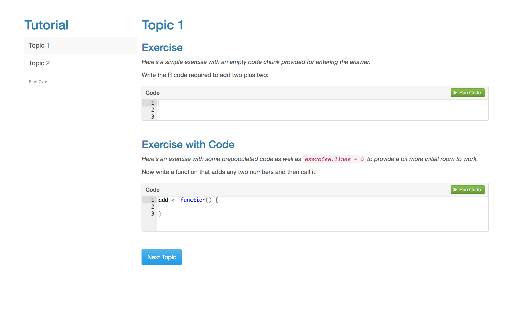

## Overview

The **learnr** package is designed to be used with a wide variety of R Markdown formats. A tutorial is simply a directory containing an R Markdown document which:

1. Loads the **learnr** package.

2. Includes one or more interactive components (exercises, quiz questions, etc.).

3. Uses the `runtime: shiny_prerendered` directive in the YAML header.

4. Uses a format which inherits from the [`html_document_base`](https://www.rdocumentation.org/packages/rmarkdown/topics/html_document_base) format and is marked as `boostrap_compatible` (this is a parameter of [`html_document_base`](https://www.rdocumentation.org/packages/rmarkdown/topics/html_document_base) which indicates that it's safe to inject Booststrap CSS into the document).

This means you can use **learnr** with the [`html_document`](http://rmarkdown.rstudio.com/html_document_format.html), [`ioslides_presentation`](http://rmarkdown.rstudio.com/ioslides_presentation_format.html), and [`slidy_presentation`](http://rmarkdown.rstudio.com/slidy_presentation_format.html) formats as well as many others. 

We've shown plenty of examples of the default format, here's an example of embedding a tutorial within a `slidy_presentation`:


You can run a live version of this example with:

```r
learnr::run_tutorial("slidy", package = "learnr")
```

## Tutorial Format

The **learnr** package includes a `learnr::tutorial` R Markdown format which which provides some default layout and behavior (including progress tracking) which you'll likely want to use in many of your tutorials. 

The format also includes features for progressively revealing sections and allowing users to optionally skip exercises they are having trouble with (both of these features are described below).

You can create a new `learnr::tutorial` document from a template via the **New R Markdown** dialog in RStudio:

{width=565 height=461}

The benefits of using the `learnr::tutorial` format include:

1. More appropriate defaults are provided for various things including figure sizes and data frame printing.

2. A floating table of contents for easy navigation between sections is provided by default. 

3. Visual adornments are added to the table of contents indicating which parts of the tutorial have been completed.

4. A "Start Over" button is added to the table of contents regsion to allow users to clear previous work within the tutorial.

Here's what a `learnr::tutorial` document looks like by default:

{width=1184 height=737 style="border: solid 1px #cccccc; margin-bottom: 12px;"}


## Custom Formats

The **learnr** package exposes a JavaScript API which can be used to create new R Markdown formats that include progress tracking similar to that which is provided by the `learnr::tutorial` format.

The implementation of the `learnr::tutorial` format is extremely straightforward and provides a template for creating additional new formats via the API:

1. The **[tutorial-format.R](https://github.com/rstudio/learnr/blob/master/R/tutorial-format.R)** file includes the definition of the custom R Markdown format function. 

2. The **[tutorial-format.js](https://github.com/rstudio/learnr/blob/master/inst/rmarkdown/templates/tutorial/resources/tutorial-format.js)** file demonstrates the use of the tutor JavaScript API to add progress tracking features to the default R Markdown floating table of contents.

3. The **[inst/rmarkdown/templates/tutorial](https://github.com/rstudio/learnr/tree/master/inst/rmarkdown/templates/tutorial)** directory includes all the files and configuration required to make the format available as a custom R Markdown template within the RStudio IDE.


