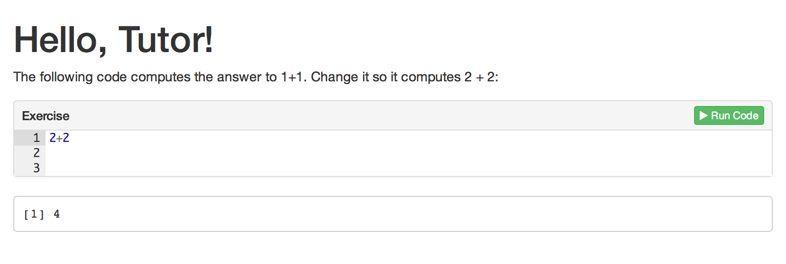

## Overview

The **tutor** package makes it easy to turn any [R Markdown](http://rmarkdown.rstudio.com) document into an interactive tutorial. Tutorials consist of content along with interactive components for checking and reinforcing understanding. Tutorials can include any or all of the following:

1. Narrative, figures, illustrations, and equations.

2. Code exercises (R code chunks that users can edit and execute directly).

3. Quiz questions.

4. Videos (supported services include YouTube and Vimeo).

5. Interactive Shiny applets.

Tutorials automatically preserve work done within them, so if a user works on a few exercises or questions and returns to the tutorial later they can pick up right where they left off.

### Hello, Tutor! 

To create a tutorial, just use `library(tutor)` within your Rmd file to activate tutorial mode, then use the `exercise = TRUE` attribute to turn code chunks into exercises. Users can edit and execute the R code and see the results right within their browser.

For example, here's a very simple tutorial:

<div id="hellotutor"></div>
<script type="text/javascript">loadSnippet('hellotutor')</script>

This is what the running tutorial document looks like after the user has entered their answer:




## Getting Started

### Installation

1. Install the development version of the **tutor** package from GitHub as follows:

    ```r
    devtools::install_github("rstudio/tutor", auth_token = "33cdbf9d899fe6eff5022e67e21f08964f7c7b19")
    ```

2. Install the [latest release of RStudio](https://www.rstudio.com/products/rstudio/download/) (v1.0.136 or later) as it includes tools for easily running and previewing tutorials.

### Creating a Tutorial

A tutorial is just a directory that contains a standard R Markdown document with three additional attributes:

1. Loads the **tutor** package.
2. Includes one or more interactive components (exercises, quiz questions, etc.).
3. Uses the `runtime: shiny_prerendered` directive in the YAML header.

The `runtime: shiny_prerendered` element included in the YAML hints at the underlying implementation of tutorials: they are simply Shiny applications which use an R Markdown document as their user-interface rather than the traditional `ui.R` file.

#### Tutorial Format

While you can use tutorial elements many different R Markdown formats (see the article on [Tutorial Formats](formats.html) for details), the **tutor** package also includes a custom `tutor::tutorial` format which provides some default layout and behavior (including progress tracking) which you'll likely want to use in many of your tutorials. 

You can create a new `tutor::tutorial` document from a template via the **New R Markdown** dialog in RStudio:

{width=609 height=482}

Note that tutorials aren't just the Rmd source file, rather they are directories that contain the Rmd source file as well as other supporting files (e.g. figures and other images). As a result the default behavior is to create new tutorials within their own directory.

#### Chunk Labels

There is one other requirement related to R code chunks that contain exercises or quiz questions: they must have a unique chunk label. For example, this chunk is labeled `addition`:

<div id="addition"></div>
<script type="text/javascript">loadSnippet('addition')</script>

This requirement exists to ensure that a stable identifier is associated with each interactive component. This in turn makes it possible to save and restore user work as well as facilitates aggregation and reporting on responses.

### Running Tutorials

Tutorials are Shiny applications that are run using the `rmarkdown::run` function rather than the `shiny::runApp` function. For example:

```r
rmarkdown::run("tutorial.Rmd")
```

If your tutorial is included within an R package you can also run it via the `tutor::run_tutorial` function. For example, you can run a live version of the "Hello, Tutor" example provided above with:

```r
tutor::run_tutorial("hello", package = "tutor")
```

## Exercises

Exercises are interactive R code chunks that allow readers to directly execute R code and see it's results:


Exercises can include hints or solutions as well as custom checking code to provide feedback on user answers. The [Exercises](exercises.html) page includes a more in depth discussion of exercises and their various available options and behaviors.

## Questions

You can include one or more multiple-choice quiz questions within a tutorial to help verify that readers understand the concepts presented. Questions can either have a single or multiple correct answers. 

Include a question by calling the `question` function within an R code chunk:

<div id="question"></div>
<script type="text/javascript">loadSnippet('question')</script>

Here's what the above question would look like within a tutorial:


The [Questions](quesiton.html) page includes additional information on using questions within tutorials.

## Videos

You can include videos published on either [YouTube](https://www.youtube.com) or [Vimeo](https://vimeo.com) within a tutorial using the standard markdown image syntax. Note that any valid YouTube or Vimeo URL will work. For example, the following are all valid examples of video embedding:

<div id="tutorvideos"></div>
<script type="text/javascript">loadSnippet('tutorvideos', 'markdown')</script>

### Video Size

Videos are responsively displayed at 100% of their container's width (with height automatically determined based on a 16x9 aspect ratio). You can change this behavior by adding attributes to the markdown where you reference the video.

You can specify an alternate percentage for the video's width or an alternate fixed width and height. For example:

<div id="videos-size"></div>
<script type="text/javascript">loadSnippet('videos-size', 'markdown')</script>

## Shiny Applets

The **tutor** package uses `runtime: shiny_prerendered` to turn regular R Markdown documents into live tutorials. Since tutorials are Shiny applications at their core, it's also possible to add other forms of interactivity using Shiny (e.g. for teaching a statistical concept interactively). 

The basic technique is to add a `context="server"` attribute to code chunks that are part of the Shiny server as opposed to UI definition. For example:

<div id="shiny"></div>
<script type="text/javascript">loadSnippet('shiny')</script>

You can learn more by reading the [Prerendered Shiny Documents](http://rmarkdown.rstudio.com/authoring_shiny_prerendered.html) article on the R Markdown website.


## External Resources

You may wish to include external resources (images, videos, CSS, etc.) within your tutorial documents. Since the tutorial will be deployed as a Shiny applications, you need to ensure that these resources are placed within one of several directories which are reachable by the Shiny web server:

<table>
<thead>
<tr class="header">
<th>Directory</th>
<th>Description</th>
</tr>
</thead>
<tbody>
<tr class="odd">
<td><code>images/</code></td>
<td>Image files (e.g. PNG, JPEG, etc.)</td>
</tr>
<tr class="even">
<td><code>css/</code></td>
<td>CSS stylesheets</td>
</tr>
<tr class="odd">
<td><code>js/</code></td>
<td>JavaScript scripts</td>
</tr>
<tr class="even">
<td><code>www/</code></td>
<td>Any other files (e.g. downloadable datasets)</td>
</tr>
</tbody>
</table>

The reason that all files within the directory of the main Rmd can't be referenced from within the web document is that you may not want all files within your tutorial's directory to be downloadable by end users. By restricting the files which can be referenced to the above directories you can control which files are downloadable and which are not.

## Preserving Work

Tutorials store the various pieces of work done within them (exercise input and output, answers to questions, etc.) and automatically restore it when users revisit them. Locally run tutorials store user work in the local filesystem and tutorials run from a server store user work within the storage provided by the end user's web browser.

### Managing Changes

One thing to keep in mind about preserved work is that if your tutorial changes significantly then the work restored may no longer match up well with the contents of your tutorial! (e.g. the nature and content of exercises and/or questions may have changed).

Tutorial work is restored using the R chunk label of a given exercise or question, so if a chunk changes significantly you can invalidate the stored work by changing the chunk label. 

#### Tutorial Identifiers

You can also invalidate stored work by changing the ID or version of your tutorial. If you publish tutorials within R packages then the version is automatically derived from the version of the package. You can also explicitly set the ID and version of a tutorial using YAML metadata, for example:

<div id="tutoryamlids"></div>
<script type="text/javascript">loadSnippet('tutoryamlids', 'markdown')</script>

Note that we use a reversed domain name for the tutorial id (`com.example.tutorials.my-first-tutorial`). This is to ensure that it is globally unique when deployed on a server with other tutorials. You could also choose to use a Universally Unique Identifier (UUID) created using the [**uuid**](https://cran.rstudio.com/web/packages/uuid/index.html) package.

When you change the ID or version of a tutorial all stored work associated with the tutorial is invalidated and users of the tutorial will start fresh when accessing it again. It's therefore good practice to change the version whenever you make significant modifications to the exercises and questions within a tutorial (again, this occurs automatically for tutorials within R packages so long as the version of the R package is changed).

## Publishing

Tutorials can be published all of the same ways that Shiny applications can, including running locally on an end-user's machine or running on a Shiny Server or hosting service like shinyapps.io. 

The most straightforward way to deploy a tutorial is to include it within an [R package](publishing.html#r-package) and have users run it directly via the `tutor::run_tutorial` function.

The [Publishing](publishing.html) page includes an in-depth discussion of the various publishing options as well as some special considerations around resources, concurrent usage, and security which come into play when deploying tutorials on a server.


