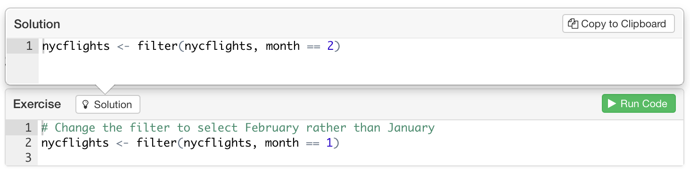
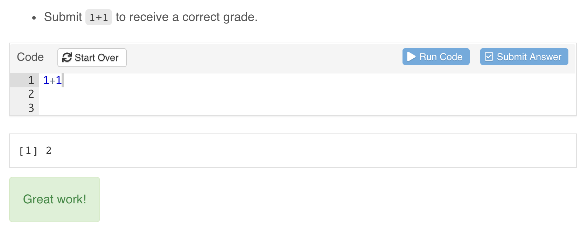
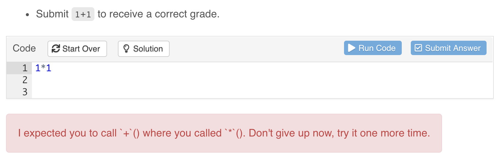
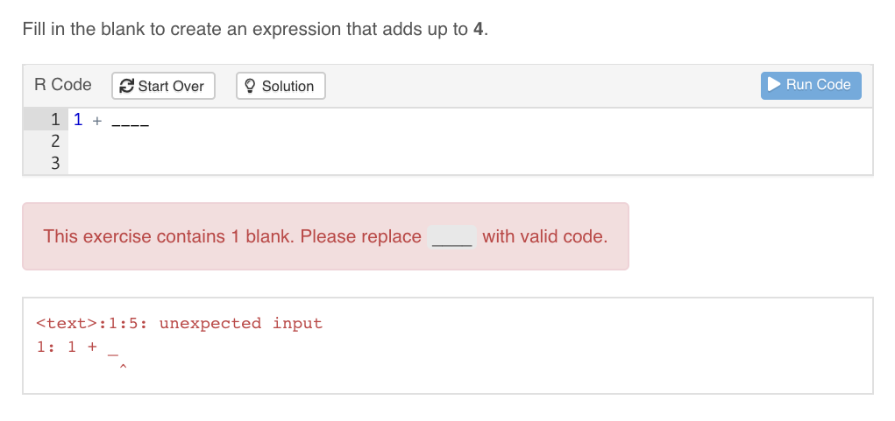
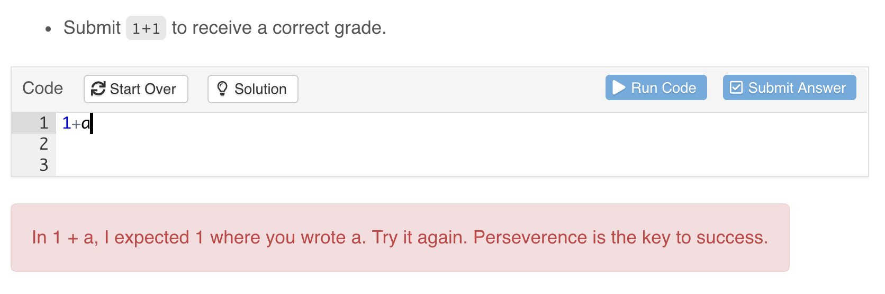
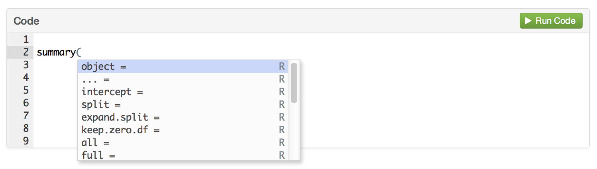

## Overview

Exercises are interactive R code chunks that allow readers to directly execute R code and see its results. There are many options associated with tutorial exercises (all of which are described in more detail below):

<table>
<thead>
<tr class="header">
<th>Option</th>
<th>Description</th>
</tr>
</thead>
<tbody>
<tr class="odd">
<td><code>exercise.cap</code></td>
<td>Caption for exercise chunk (defaults to "Code")</td>
</tr>
<tr class="even">
<td><code>exercise.eval</code></td>
<td>Whether to pre-evaluate the exercise so the reader can see some default output (defaults to <code>FALSE</code>).</td>
</tr>
<tr class="odd">
<td><code>exercise.lines</code></td>
<td>Lines of code for exercise editor (default to size of code chunk).</td>
</tr>
<tr class="even">
<td><code>exercise.timelimit</code></td>
<td>Number of seconds to limit execution time to (defaults to 30).</td>
</tr>
<tr class="odd">
<td><code>exercise.checker</code></td>
<td>Function used to check exercise answers (e.g., <code>gradethis::grade_learnr()</code>).</td>
</tr>
<tr class="even">
<td><code>exercise.blanks</code></td>
<td>Regular expression to find blanks requiring replacement in the exercise code. See [Checking Blanks](#checking-blanks) below.</td>
</tr>
<tr class="odd">
<td><code>exercise.error.check.code</code></td>
<td>A string containing R code to use for checking code when an exercise evaluation error occurs (e.g., <code>"gradethis::grade_code()"</code>).</td>
</tr>
<tr class="even">
<td><code>exercise.completion</code></td>
<td>Whether to enable code completion in the exercise editor.</td>
</tr>
<tr class="odd">
<td><code>exercise.diagnostics</code></td>
<td>Whether to enable code diagnostics in the exercise editor.</td>
</tr>
<tr class="even">
<td><code>exercise.startover</code></td>
<td>Whether to include a "Start Over" button for the exercise.</td>
</tr>
<tr class="odd">
<td><code>exercise.warn_invisible</code></td>
<td>Whether to display an invisible result warning if the last value returned is invisible.</td>
</tr>
<tr class="even">
<td><code>exercise.reveal_solution</code></td>
<td>Whether or not the solution should be revealed to the user (defaults to `TRUE`). See [Hiding Solutions](#hiding-solutions) below.</td>
</tr>
</tbody>
</table>

Note that these options can all be specified either globally or per-chunk. For example, the following code sets global default options using the `setup` chunk and also sets some local options on the `addition` chunk:

```{r snippet-exerciseoptions, echo = FALSE}
source("snippets.R")
insert_snippet("exerciseoptions")
```

There are also some other specialized chunks that can be used with an exercise chunk, including:

1. Exercise [setup chunks](#exercise-setup), which enable you to execute code to setup the environment immediately prior to executing submitted code.

2. Exercise [solution chunks](#exercise-solutions) which enable you to provide a solution to the exercise that can be optionally viewed by users of the tutorial.

The use of these special chunks is also described in detail below.


## Exercise Evaluation

By default, exercise code chunks are NOT pre-evaluated (i.e there is no initial output displayed for them). However, in some cases you may want to show initial exercise output (especially for exercises like the ones above where the user is asked to modify code rather than write new code from scratch).

You can arrange for an exercise to be pre-evaluated (and its output shown) using the `exercise.eval` chunk option. This option can also be set either globally or per-chunk:

```{r snippet-exerciseeval, echo = FALSE}
insert_snippet("exerciseeval")
```

## Exercise Setup

Code chunks with `exercise=TRUE` are evaluated within standalone environments. This means that they don't have access to previous computations from within the document. This constraint is imposed so that users can execute exercises in any order (i.e. correct execution of one exercise never depends on completion of a prior exercise).

### Exercise Setup Chunks

You can arrange for setup code to be run before evaluation of an exercise to ensure that the environment is primed correctly. There are three ways to provide setup code for an exercise:

1. Add code to a [global `setup` chunk](#setup-global)
1. Create a [shared setup chunk](#setup-shared)
1. Create an [exercise-specific setup chunk](#setup-exercise-specific)

Each of these is described in more detail below. Note that you may also [chain setup chunks](#setup-chained), which is particularly helpful when exercises build upon each other.

#### Add code to the global `setup` chunk {#setup-global}

Code in the global `setup` chunk is run once at the startup of the tutorial and is shared by all exercises within the tutorial. For example:

```{r snippet-exercisesetup, echo = FALSE}
insert_snippet("exercisesetup")
```
#### Create a shared setup chunk {#setup-shared}

If you don't want to rely on global setup but would rather create setup code that's used by only a handful of exercises you can use the `exercise.setup` chunk attribute to provide the label of another chunk that will perform setup tasks. To illustrate, we'll re-write the previous example to use a shared setup chunk named `prepare-flights`:

```{r snippet-exercisesetupshared, echo = FALSE}
insert_snippet("exercisesetupshared")
```
#### Create an exercise-specific `-setup` chunk {#setup-exercise-specific}

**learnr** will automatically associate any chunk with a label in the format `<exercise>-setup` as a setup chunk specifically associated with `<exercise>`, where `<exercise>` is replaced with the label of the exercise chunk. For example, the `filter-setup` chunk will be used as the setup chunk for the `filter` exercise:

```{r snippet-exercisesetupsuffix, echo = FALSE}
insert_snippet("exercisesetupsuffix")
```
#### Chained setup chunks {#setup-chained}

If may also chain setup chunks where each setup chunk inherits its parent setup chunk using the `exercise.setup` chunk option. (**Note**: You must use `exercise.setup` for chaining. You cannot rely on the `-setup` suffix labelling scheme.) **learnr** will keep following the trail of `exercise.setup` chunks until there are no more chunks to be found. To demonstrate, we can convert the first exercise in the above examples to be another setup chunk called `filtered-flights` with its `exercise.setup=prepare-flights`. This will now filter the data and store it and can be referenced inside the `arrange` exercise:

```{r snippet-exercisesetupchained, echo = FALSE}
insert_snippet("exercisesetupchained")
```
You can chain use exercise chunks in the setup chunk chain, but keep in mind that the code as it appears in the R Markdown source is used to serve as the setup code, not the user input. For example, if you turned `filtered-flights` back to an exercise, the pre-filled code is used as setup for the `arrange` exercise that use it as its setup:

```{r snippet-exercisechained, echo = FALSE}
insert_snippet("exercisechained")
```
### Using Files in Exercises

Occasionally, you may write an exercise that requires users to interact with files on disk, such as data files in `.csv` or `.rds` format. **learnr** will look for a folder named `data/` in the same directory as the tutorial source and, if present, will make this directory available to users in all exercises in the tutorial.

To ensure consistency between each evaluation of the user's code, users interact with a temporary copy of the original directory. This way, users cannot overwrite or delete the original files. Additionally, in the exercise, the directory is always called `data/`.

There are three ways authors can include files for use in exercises:

1. Store the files in a `data/` directory in the same directory as the tutorial.

1. Use the setup chunk to download or write the files to a `data/` directory.

1. Use the `tutorial.data_dir` global option or the `TUTORIAL_DATA_DIR` environment variables to specify a path to a data directory.

In the example below, the global setup chunk is used to write `data/flights_jan.csv` and users are asked to load this file with `read_csv()`.

```{r snippet-exercisedata, echo = FALSE}
insert_snippet("exercisedata")
```
## Hints and Solutions

You can optionally provide a hint or solution for each exercise that can be optionally displayed by users. Hints can be based on either R code snippets or on custom markdown/HTML content.

### R Code Hints

To create a hint or solution based on R code simply create a new code chunk with "-hint" or "-solution" chunk label suffix. For example:

```{r snippet-exercisesolution, echo = FALSE}
insert_snippet("exercisesolution")
```
A "Hint" or "Solution" button is added to the left side of the exercise header region:



### Markdown Hints

To create a hint based on custom markdown content simply add a `<div>` tag with an `id` attribute that marks it as hint for your exercise (e.g. "filter-hint"). For example:

```{r snippet-exercisehintdiv, echo = FALSE}
insert_snippet("exercisehintdiv")
```
The content within the `<div>` will be displayed underneath the R code editor for the exercise whenever the user presses the "Hint" button.

### Multiple Hints

For R code hints you can provide a sequence of hints that reveal progressively more of the solution as desired by the user. To do this create a sequence of indexed hint chunks (e.g. "-hint-1", "-hint-2, "-hint-3", etc.) for your exercise chunk. For example:

```{r snippet-exercisehints, echo = FALSE}
insert_snippet("exercisehints")
```
### Hiding Solutions

By default, the exercise solution is made available to the user with the "Solution" or "Hint" button (if there are hints those will appear first). If you would prefer not to reveal the solution to an exercise, you can disable revealing the solution by adding `exercise.reveal_solution = FALSE` to the chunk options of either the exercise or its corresponding `*-solution` chunk.

```{r snippet-exercisesolutionhidden, echo = FALSE}
insert_snippet("exercisesolutionhidden")
```
You can also set this option globally in the global `setup` chunk with `tutorial_options()`. When set this way, the chunk-level option will take precedence over the global option so that you can choose to always reveal or hide the solution to a particular exercise. The current default is to reveal exercise solutions, but in a future version of learnr the default behavior will change to hide solutions.

## Progressive Reveal

You might want users of your tutorials to see only one sub-topic at a time as they work through the material (this can be helpful to reduce distractions and maintain focus on the current task). If you specify the `progressive` option then all Level 3 headings (`###`) will be revealed progressively. For example:

```{r snippet-tutorialyaml-progressive, echo = FALSE}
insert_snippet("tutorialyaml-progressive")
```
You can also specify this option on a per topic basis using the `data-progressive` attribute. For example, the following code enables progressive rendering for a single topic:

```{r snippet-tutorialyaml-progressive-topic, echo = FALSE}
insert_snippet("tutorialyaml-progressive-topic")
```
You can also use `data-progressive=FALSE` to disable progressive rendering for an individual topic if the global `progressive` option is `TRUE`.

Progressive reveal provides an easy way to cue exercises one at a time: place each exercise under its own Level 3 header (`###`). This can be useful when a second exercises builds on the first, giving away the answer to the first.

Note that this feature is only available if you are using the [`learnr::tutorial`](formats.html#tutorial-format) R Markdown format (other custom formats may have their own internal mechanisms for progressive reveal).

### Exercise Skipping

When the `progressive` option is set to true, the tutorial will require students to complete any exercises in a sub-section before advancing to the next sub-section.

You may want to allow users of your tutorials to skip through exercises that they can't quite figure out. This might especially be true if you want users to be able to optionally see the next exercise even if they haven't completed the prior one.

If you specify the `allow_skip` option then students will be able to advance through a sub-section without completing the exercises. For example:

```{r snippet-tutorialyaml-allowskip, echo = FALSE}
insert_snippet("tutorialyaml-allowskip")
```
You can also specify this option on a per sub-topic basis using the `data-allow-skip` attribute. For example, the following code enables exercise skipping within a single sub-topic:

```{r snippet-tutorialyaml-allowskip-topic, echo = FALSE}
insert_snippet("tutorialyaml-allowskip-topic")
```
You can also use `data-allow-skip=FALSE` to disable exercise skipping rendering for an individual sub-topic if the global `allow-skip` option is `TRUE`.

## Exercise Checking

**learnr** provides allows full control over feedback provided to exercise submissions via `exercise.checker` in `tutorial_options()`. We'll eventually cover how to implement a custom `exercise.checker`, but for sake of demonstration, this section uses [**gradethis**](https://github.com/rstudio-education/gradethis)'s approach to exercise checking, which doesn't require knowledge of `exercise.checker` (**NOTE**: **gradethis** is still a work-in-progress. You may want to consider alternatives such as [**checkr**](https://github.com/dtkaplan/checkr)). To use **gradethis**'s approach to exercise checking inside of **learnr**, just call `gradethis_setup()` in a [setup](#Exercise_Setup) chunk, which will set `tutorial_options(exercise.checker = gradethis::grade_learnr)` (among other things).

### Checking Results

Checking of exercise results may be done through a `*-check` chunk. With a **gradethis** setup, results can be graded with `grade_result()`, like so:

```{r snippet-exercisecheck, echo = FALSE}
insert_snippet("exercisecheck")
```
When an exercise `*-check` chunk is provided, **learnr** provides an additional "Submit Answer" button, which allows users to experiment with various answers before formally submitting an answer:



### Checking Code

Checking of exercise *code* may be done through a `*-code-check` chunk. With a **gradethis** setup, if you supply a `*-solution` chunk and call `grade_code()` inside `*-code-check`, then you get detection of differences in the R syntax between the submitted exercise code and the solution code.

```{r snippet-exercisecodecheck, echo = FALSE}
insert_snippet("exercisecodecheck")
```


It's worth noting that, when a `*-code-check` chunk is supplied, the check is done *prior* to evaluation of the exercise submission, meaning that if the `*-code-check` chunk returns feedback, then that feedback is displayed, no exercise code is evaluated, and no result check is performed.

### Checking Blanks

Occasionally, you may include blanks in the pre-filled code in your exercise prompts --- sections of the code in the exercise prompt that students should fill in. By default, **learnr** will detect sequences of three or more underscores, e.g. `____` as blanks, regardless of where they appear in the user's submitted code.

```{r snippet-exerciseblanks, echo = FALSE}
insert_snippet("exerciseblanks")
```


You can choose your own blank pattern by setting the `exercise.blanks` chunk option to a regular expression  that identifies your blanks. You may also set `exercise.blanks = TRUE` to use the default **learnr** blank pattern, or `exercise.blanks = FALSE` to skip blank checking altogether. Globally `tutorial_options()` can be used to set the value of this argument for all exercises.

Submitted code with blanks will still be evaluated, but the other exercise checks will not be performed. This lets the student see the output of their code---which may produce a valid result---but still draws the student's attention to the code that needs to be completed.

### Checking Errors

In the event that an exercise submission generates an error, checking of the code (or its result, which is an error condition) may be done through either a `*-error-check` chunk or through the global `exercise.error.check.code` option. If an `*-error-check` chunk is provided, you must also include a `*-check` chunk, typically to provide feedback in case the submission _doesn't_ generate an error.

With a **gradethis** setup, `exercise.error.check.code` is set to `grade_code()`. This means that, by default, users will receive intelligent feedback for a submission that generates an error using the `*-solution` chunk, if one is provided.



To learn more about grading exercises with **gradethis**, see its grading demo ([`gradethis::gradethis_demo()`](https://github.com/rstudio-education/gradethis/blob/main/inst/tutorials/grading-demo/grading-demo.Rmd)).

### Custom Checking

If you need custom exercise checking logic that isn't already provided grading packages like [**gradethis**](https://github.com/rstudio-education/gradethis), then you may want to write your own `exercise.checker` function. This function is called on exercise submission whenever `*-check` or `*-code-check` chunks exist. When called, this function receives all the information that **learnr** knows about the exercise at the time of the checking, including the `user_code`, `solution_code`, `check_code`, exercise environments, the `last_value` (if any), and the `stage` of checking. Checking can be performed at three different time points, so the values supplied can differ depending on the time point:

1. Before exercise evaluation, at this stage:
    * `stage` is `"code_check"`.
    * `check_code` contains `*-code-check` chunk code.
    * `envir_result`, `evaluate_result`, and `last_value` are all `NULL`.
2. During evaluation, when an error occurs:
    * `stage` is `"error_check"`.
    * `check_code` contains `*-error-check` chunk code.
    * `last_value` contains the error condition object.
3. After exercise evaluation, at this stage:
    * `stage` is `"check"`.
    * `check_code` contains `*-check` chunk code.
    * `last_value` contains the last printed value.

If, at any one of these stages, feedback should be provided, then `exercise.checker` should return an R list with, at the very least, a `correct` flag and feedback `message`:

<table>
<thead>
<tr class="header">
<th>Field</th>
<th>Description</th>
</tr>
</thead>
<tbody>
<tr class="odd">
<td><code>message</code></td>
<td>Feedback message. Can be a plain character vector or can HTML produced via the <a href="https://cran.r-project.org/web/packages/htmltools/index.html">htmltools</a> package.</td>
</tr>
<tr class="even">
<td><code>correct</code></td>
<td>TRUE/FALSE logical value indicating whether the submitted answer was correct.</td>
</tr>
<tr class="odd">
<td><code>type</code></td>
<td>Feedback type (visual presentation style). Can be "auto", "success", "info", "warning", "error", or "custom". Note that "custom" implies that the "message" field is custom HTML rather than a character vector.</td>
</tr>
<tr class="even">
<td><code>location</code></td>
<td>Location for feedback ("append", "prepend", or "replace").</td>
</tr>
</tbody>
</table>

Below is a rough sketch of how one might implement an `exercise.checker` function.

```{r snippet-customchecker, echo = FALSE}
insert_snippet("customchecker")
```
See the table below for a full description of all the arguments supplied to `exercise.checker`.

<table>
<thead>
<tr class="header">
<th>Argument</th>
<th>Description</th>
</tr>
</thead>
<tbody>
<tr class="odd">
<td><code>label</code></td>
<td>Label for exercise chunk.</td>
</tr>
<tr class="even">
<td><code>user_code</code></td>
<td>R code submitted by the user.</td>
</tr>
<tr class="odd">
<td><code>solution_code</code></td>
<td>Code provided within the "-solution" chunk for the exercise.</td>
</tr>
<tr class="even">
<td><code>check_code</code></td>
<td>Code provided within the "-check" chunk for the exercise.</td>
</tr>
<tr class="odd">
<td><code>envir_result</code></td>
<td>The R environment <b>after</b> the execution of the chunk.</td>
</tr>
<tr class="even">
<td><code>evaluate_result</code></td>
<td>The return value from the <a href="https://www.rdocumentation.org/packages/evaluate/topics/evaluate"><code>evaluate::evaluate</code></a> function.</td>
</tr>
<tr class="odd">
<td><code>envir_prep</code></td>
<td>A copy of the R environment <b>before</b> the execution of the chunk.</td>
</tr>
<tr class="even">
<td><code>last_value</code></td>
<td>The last value of the evaluated chunk.</td>
</tr>
<tr class="odd">
<td><code>engine</code></td>
<td>The <code>engine</code> value of the evaluated chunk.</td>
</tr>
<tr class="even">
<td><code>stage</code></td>
<td>The current checking <code>stage</code>.</td>
</tr>
<tr class="odd">
<td><code>...</code></td>
<td>Unused (include for compatibility with parameters to be added in the future)</td>
</tr>
</tbody>
</table>


## Exercise Caption

By default exercises are displayed with caption of "Code". However, in some cases you may want either a custom per-chunk caption or a generic caption with a different connotation (e.g. "Exercise" or "Sandbox"). For example:

```{r snippet-exercisecaption, echo = FALSE}
insert_snippet("exercisecaption")
```
## Code Assistance

By default, code completions are automatically provided as users type within the exercise editor:



You can optionally disable code completion (either globally or on a per-chunk basis) using the `exercise.completion` option. For example, the following illustrates turning off completions globally then enabling them for an individual chunk:

```{r snippet-exercisecompletion, echo = FALSE}
insert_snippet("exercisecompletion")
```
Similarily, simple code diagnostics can also be provided, to inform users of errors in the R code written in exercise editors. Diagnostics can be controlled (either globally or on a per-chunk basis) using the `exercise.diagnostics` option.

## Editor Size

By default, the size of the exercise editor provided to users will match the number of lines in your code chunk (with a minimum of 2 lines). If the user adds additional lines in the course of editing the editor will grow vertically up to 15 lines, after which it will display a scrollbar.

You can also specify a number of lines explicitly using the `exercise.lines` chunk option (this can be done on a per-chunk or global basis). For example, the following chunk specifies that the exercise code editor should be 15 lines high:

```{r snippet-exerciselines, echo = FALSE}
insert_snippet("exerciselines")
```
## Time Limits

To mediate the problem of code which takes longer than expected to run you can specify the `exercise.timelimit` chunk option or alternatively the global `tutorial.exercise.timelimit` option.

The following demonstrates setting a 10 second time limit as a global option, document level option, and chunk level option:

```{r snippet-exercisetimelimit, echo = FALSE}
insert_snippet("exercisetimelimit")
```
Since tutorials are a highly interactive format you should in general be designing exercises that take no longer than 5 or 10 seconds to execute. Correspondingly, the default value for `tutorial.exercise.timelimit` if not otherwise specified is 30 seconds.
