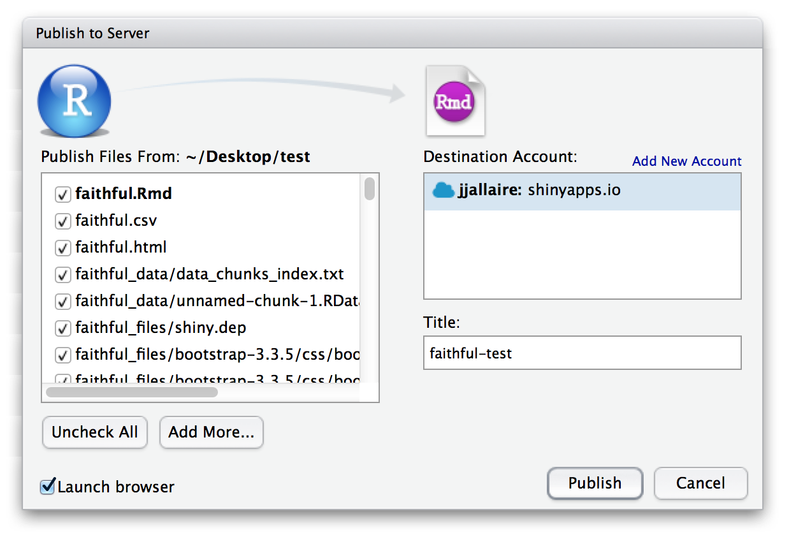

Tutorials can be published all of the same ways that Shiny applications can, including running locally on an end-user's machine or running on a Shiny Server or hosting service like [shinyapps.io](https://www.shinyapps.io).

## R Package

A very convenient way to publish tutorials is within R packages. Tutorials included within R packages can be run via the `learnr::run_tutorial` function. For example, the following functions runs the "hello" and "slidy" sample tutorials built in to the **learnr** package:

```r
learnr::run_tutorial("hello", package = "learnr")
learnr::run_tutorial("slidy", package = "learnr")
```

To bundle a tutorial into an R package and make it available for running via the `run_tutorial` function you should:

1. Create a `tutorials` directory within the `inst` sub-directory of your package and then create a directory for your tutorial there (e.g. `inst/tutorials/hello`, `inst/tutorials/slidy`, etc.).

2. Add the `.Rmd` associated with your tutorial in that directory. (You may see a
`..._files/` directory or a `.html` file that periodically get generated adjacent
to your `.Rmd` tutorial. You can safely ignore, delete, or exclude these from your
package and from version control. They are temporary artifacts produced while
rendering the tutorial on your specific system and aren't likely to be
portable to other environments.)

Once you've done this users can run your tutorial as follows (note they should be sure to install the **learnr** package before attempting to run the tutorial):

Users would then simply install learnr directly before running your tutorial, for example:

```r
install.packages("learnr")
learnr::run_tutorial("introduction", package = "mypackage")
```

### Exercise Checkers {.toc-ignore}

Note that if your tutorial performs [exercise checking](exercises.html#checking-exercises) via an external package then you should be sure to add the package you use for checking as an `Imports` dependency of your package so it's installed automatically along with your package.

Note that it's likely that the **learnr** package will eventually include or depend on another package that provides checking functions. For the time being though explicit installation of external checking packages is a requirement.

## Tutorial deployment

### RStudio Connect and shinyapps.io

You can also deploy tutorials on a server as you'd deploy any other Shiny application. There are several ways to do this, two of which are:

1. Publish to the [shinyapps.io](http://www.shinyapps.io/) cloud service.

2. Publish to an [RStudio Connect](https://www.rstudio.com/products/connect/) server.

For both of these methods, you can use the RStudio IDE's integrated [one-click publishing](https://support.rstudio.com/hc/en-us/articles/228270928-Push-button-publishing-to-RStudio-Connect) to publish directly from your desktop:

{width=669 height=421}

### Shiny Server (Open Source and Pro versions)

A third way of publishing your tutorial is to serve it as a `.Rmd` document in a hosted directory of [Shiny Server](https://www.rstudio.com/products/shiny/shiny-server/).

Shiny Server fully supports interactive R Markdown documents. To take advantage of this capability, you will need to make sure that `rmarkdown` is installed and available for all users. You can do so by running the following command:

```sh
sudo su - -c "R -e \"install.packages('rmarkdown')\""
```

If a hosted directory does not include an `app.R` or a `server.R` file, Shiny Server will look to see if it contains any `.Rmd` files. If so, Shiny Server will host that directory in "R Markdown" mode using `rmarkdown::run()`.

Particular `.Rmd` files can be accessed by referencing their full path including the filename, e.g., http://myserver.org/mydocs/hello.Rmd. (Note that you need to finish the url with `.Rmd`, not `.html`). If a request is made to a directory rather than to a particular `.Rmd` file, Shiny Server will attempt to serve the file `index.Rmd`. If that file does not exist, the user will get an error alerting them that the file is not available.

### Resource Usage

Since users can execute arbitrary R code within a tutorial, this code can also consume arbitrary resources and time! (e.g. users could create an infinite loop or allocate all available memory on the machine).

To limit the time taken for the execution of exercises you can use the `exercise.timelimit` option. see the documentation on [Exercise Time Limits](exercises.html#time-limits) for additional details.

You can use various features of [RStudio Connect](https://www.rstudio.com/products/connect/) and [Shiny Server Pro]([Shiny Server](https://www.rstudio.com/products/shiny/shiny-server/)) to run tutorials within a resource and/or filesystem sandbox.

See also the section below on [Exercise Execution] for details on further customizing the evaluation environment for exercises.

### Security Considerations

Since tutorials enable end users to submit R code for execution on the server, you need to architect your deployment of tutorials so that code is placed in an appropriate sandbox. There are a variety of ways to accomplish this including placing the entire Shiny Server in a container or Linux namespace that limits it's access to the filesystem and/or other system resources.

Note that by default when running on UNIX systems the **learnr** package runs exercise code within a forked child process. This means that it's not possible for exercise code to modify the state of the parent Shiny Server process. You can further customize the evaluation environment for exercises using AppArmor and other system resource management facilities (see the [Exercise Execution] section below for details).

#### Deployment Dependencies Not Found

If your tutorial contains broken code within exercises for users to fix, the CRAN version of [`packrat`](https://github.com/rstudio/packrat/) will not find all of your dependencies to install when the tutorial is deployed.  To deploy tutorials containing broken exercise code, install the development version of `packrat`.  This version of `packrat` is able to find dependencies per R chunk, allowing for _broken_ R chunks within the tutorial file.

```{r, eval = FALSE}
devtools::install_github("rstudio/packrat")
```


## Hosting Services

Publishing tutorials to a server makes them instantly accessible to any user with a web browser, and requires no local installation of R or R packages. It also opens up the possibility of collecting data on user interactions with tutorials (progress made, errors encountered, etc.).

The **learnr** package includes a variety of mechanisms intended to make it easy to deploy within a tutorial hosting service, each of which are described below. As of this writing there are no publicly available tutorial hosting services, however we hope this will change soon, and will update this documentation as services become available.

### Tutorial Storage

Tutorials save the state of inputs and outputs (e.g. exercise and question submissions) and automatically restore them when users revisit the tutorial. For locally deployed tutorials (e.g. tutorials run from within an R package) this state is saved within the local filesystem.

For server deployed tutorials the state is saved within the per-domain storage provided by the end user's web browser. This has the benefit of saving and restoring state on a per-user basis without any notion of user authentication or identity, however will only work within a single web browser (i.e. state won't be restored if the users accesses the same tutorial from another machine).

#### Storage Provider

Hosting services will typically want to provide a custom implementation for the storage of tutorial state which is tied to their tutorial provisioning  and user identity system.

A custom storage provider is specified by assigning an R list which includes the storage functions to the `tutorial.storage` global option. For example, here is a "no-op" storage provider:

<div id="tutorstorage"></div>
<script type="text/javascript">loadSnippet('tutorstorage')</script>

The parameters passed to the storage provider's functions are as follows (note that the various ID fields can be customized by a hosting provider, see the [Tutorial Identifiers] section below for details):

<table>
<thead>
<tr class="header">
<th>ID</th>
<th>Default</th>
</tr>
</thead>
<tbody>
<tr class="odd">
<td>tutorial_id</td>
<td>Unique identfier for tutorial.</td>
</tr>
<tr class="even">
<td>tutorial_version</td>
<td>Tutorial version.</td>
</tr>
<tr class="odd">
<td>user_id</td>
<td>Unique identfier for user.</td>
</tr>
<tr class="even">
<td>object_id</td>
<td>Unique identifier for R object.</td>
</tr>
<tr class="odd">
<td>data</td>
<td>R object to be saved</td>
</tr>
</tbody>
</table>


### Exercise Execution

Note that by default when running on UNIX systems the **learnr** package runs exercise code within a forked child process. This means that it's not possible for exercise code to modify the state of the parent Shiny Server process. The section below describe the various ways of further customizing exercise execution.

#### Start and Cleanup Hooks

The **learnr** package can have it's exercise evaluation environment customized using `onstart` and `oncleanup` hooks. Within these hooks you can use functions from [RAppArmor](https://cran.r-project.org/web/packages/RAppArmor/index.html) package or another package that provides interfaces to system resource management functions.

Using this method you can apply time limits, resource limits, and filesystem limits. Here are the steps required to use RAppArmor with the `onstart` and `oncleanup` hooks:

1. Install and configure the **RAppArmor** package as described here: https://github.com/jeroenooms/RAppArmor#readme

2. Add the following line to the `/etc/apparmor.d/rapparmor.d/r-user` profile (this is required so that the default AppArmor profile also support calling the pandoc markdown renderer):

    ```
    /usr/lib/rstudio/bin/pandoc/* rix,
    ```

3. Define `onstart` and `oncleaup` hooks by setting the `tutorial.exercise.evaluator.onstart` and `tutorial.exercise.evaluator.oncleanup` global options. For example:

    <div id="exerciseevaluator"></div>
    <script type="text/javascript">loadSnippet('exerciseevaluator')</script>

You'd likely set these options within `Rprofile.site` or another R source file that is evaluated prior to running the tutorial with `rmarkdown::run`.

#### Fully Custom Evaluator

You can replace the default exercise evaluation code entirely with your own via the `tutorial.exercise.evaluator` global R option. The evaluator is an R function that accepts four arguments:

  1. An expression to evaluate
  2. A timelimit for evaluation
  3. A serializable representation of the exercise to be evaluated
  4. The session associated with the request

It returns a list of functions (`start`, `completed`, and `result`) to use for execution.

The two default evaluators (used for Windows/MacOS and UNIX systems, respectively, are):

1. `inline_evaluator` --- Evaluate exercises inline within the main Shiny Server process (this is the default on Windows and Mac OS systems).

2. `forked_evaluator` --- Evaluate exercises within a forked child process (this is the default on UNIX systems).

You can see the source code for these evaluators here: <https://github.com/rstudio/learnr/blob/main/R/evaluators.R>.

The pararmeters provided to the evaluator may be expanded in the future, so custom evaluators should permit additional arguments that have not yet been defined.

##### External Evalutor

In versions of learnr later than 0.10.1, there is also support for a `external_evaluator`. This evaluator allows exercises to be executed on a remote host rather than on the host running the Shiny process. You can use this evaluator by specifying a `tutorial.external.host` option or setting a `TUTORIAL_EXTERNAL_EVALUATOR_HOST` environment variable. If set, learnr will submit exercises over HTTP to the specified host.

The given host is expected to fulfill [this OpenAPI specification](openapi/openapi.yaml). In other words, it has two HTTP endpoints:

1. `POST /learnr/` - Initiate a session
2. `POST /learnr/<session ID>` - Submit an exercise to run as a part of a session

## Events

Learnr has an event system which can be used for recording information about usage, or for causing code to run when events occur.

As part of deploying a tutorial you might want to record the various user events which occur within tutorials (e.g. exercise and question submissions, requests for hints/solutions, etc.).

The event system can also be used to cause arbitrary code to run when the events occur.


### Recording Events

You can capture events by using a custom event recorder function. This function is specified via the `tutorial.event_recorder` global option. For example, here's how you would define a simple event recorder function that prints to stdout:

<div id="tutorrecorder"></div>
<script type="text/javascript">loadSnippet('tutorrecorder')</script>

The following parameters are passed to the event recorder function (note that the various ID fields can be customized by a hosting provider, see the [Tutorial Identifiers] section below for details):

<table>
<thead>
<tr class="header">
<th>ID</th>
<th>Default</th>
</tr>
</thead>
<tbody>
<tr class="odd">
<td>tutorial_id</td>
<td>Unique identfier for tutorial.</td>
</tr>
<tr class="even">
<td>tutorial_version</td>
<td>Tutorial version.</td>
</tr>
<tr class="odd">
<td>user_id</td>
<td>Unique identfier for user.</td>
</tr>
<tr class="even">
<td>event</td>
<td>Event name (see below for various valid values).</td>
</tr>
<tr class="odd">
<td>data</td>
<td>Custom event data.</td>
</tr>
</tbody>
</table>


The `event` parameter is one of the following values:

<table>
<thead>
<tr class="header">
<th>Event</th>
<th>Description</th>
</tr>
</thead>
<tbody>
<tr class="odd">
<td>exercise_hint</td>
<td>User requested a hint or solution for an exercise.</td>
</tr>
<tr class="even">
<td>exercise_submitted</td>
<td>User submitted an answer for an exercise.</td>
</tr>
<tr class="odd">
<td>exercise_result</td>
<td>The evaluation of an exercise has completed.</td>
</tr>
<tr class="even">
<td>question_submission</td>
<td>User submitted an answer for a multiple-choice question.</td>
</tr>
<tr class="odd">
<td>video_progress</td>
<td>User watched a segment of a video.</td>
</tr>
<tr class="even">
<td>section_skipped</td>
<td>A section of the tutorial was skipped.</td>
</tr>
<tr class="odd">
<td>section_viewed</td>
<td>A section of the tutorial became visible.</td>
</tr>
<tr class="even">
<td>session_start</td>
<td>A new session has been initiated</td>
</tr>
<tr class="odd">
<td>session_stop</td>
<td>A session has been terminated</td>
</tr>
</tbody>
</table>

The `data` parameter is an R list which provides additional data that varies depending on which `event` is being recorded.

### Event handlers

It can also be useful to cause code to run when an event occurs. The `event_register_handler()` function can be used for this. For example, this will cause a a message to be printed to the console when the `"section_viewed"` event is triggered:

<pre><code>```{r context="server-start"}
event_register_handler("section_viewed", function(session, event, data) {
  message("event: section_viewed: ", data$sectionId)
})
```</code></pre>

Note that `event_register_handler()` should be called in a code chunk with `context="server-start"`!

The callback must take three parameters:

- `session`: This is a Shiny session object.
- `event`: The name of the event (like `"section_viewed"`).
- `data`: This is a list that contains arbitrary data.

In some cases it is useful to have handlers that are triggered just once in the tutorial. This can be done with the `one_time()` function. Inside of the handler, call `one_time()`, and pass it the `session` object, `cond`, a condition expression, and `expr`, the code expression to run.

The first time `cond` is true, `expr` will be evaluated; after that, `expr` will not be evaluated again. In the example here, `cond` is true when time the section with ID `"section-exercise-with-hint"` is viewed, and so the first time that section is visible, it will print out a message.

<pre><code>```{r context="server-start"}
event_register_handler("section_viewed",
  function(session, event, data) {
    one_time(
      session,
      cond = data$sectionId == "section-exercise-with-hint",
      expr = { message("Seeing ", data$sectionId, " for the first time.") }
    )
  }
)
```</code></pre>

Technical note: The reason that `one_time()` has an unusual interface is because it needs to be able to store data that persists across runs of the tutorial. The code will run one time, even if the user stops the document and starts it again; it resets when the user clicks on "Start Over".

The section IDs are generated automatically from the section title. For example, if this is the section heading:

```
### This is a section
```

Then the ID will be `section-this-is-a-section`. If you want to use a different ID, you can supply it in curly braces, and it will be prepended with `section-`. This will set the ID to `section-myid`:

```
### This is a section {#myid}
```

You can even have sections that don't have a title, but do have an ID:

```
### {#myid}
```


### Tutorial Identifiers

The [Tutorial Storage] and [Recording Events] sections above describe various ways to record user progress and actions within tutorials. Storage of tutorial state requires unique identifiers for tutorials (and their versions) as well as users.

Tutorial hosting services will often need to customize these identifiers based on their own notions of tutorial provisioning and user identify. This section describes how to do this.

#### Default Identifiers

The default tutorial and user identifiers are determined as follows:

<table>
<thead>
<tr class="header">
<th>ID</th>
<th>Default</th>
</tr>
</thead>
<tbody>
<tr class="odd">
<td>tutorial_id</td>
<td>Network origin and path of tutorial.</td>
</tr>
<tr class="even">
<td>tutorial_version</td>
<td>1.0</td>
</tr>
<tr class="odd">
<td>user_id</td>
<td>Account name of server user executing the tutorial</td>
</tr>
</tbody>
</table>

In addition, tutorial authors can use YAML metadata to provide custom tutorial IDs and versions. For example:

<div id="tutoryamlids"></div>
<script type="text/javascript">loadSnippet('tutoryamlids')</script>

#### Custom Identifiers

Tutorial hosting services will very often need to provide custom external definitions for tutorial IDs/versions and user IDs. This can be accomplished by adding HTTP headers to the requests that route to the tutorial. The names of the headers are configurable, and should be specified using the `tutorial.http_header_tutorial_id`, `tutorial.http_header_tutorial_version` and `tutorial.http_header_user_id` global options. For example:

<div id="tutorids"></div>
<script type="text/javascript">loadSnippet('tutorids')</script>

Once configuring these custom header names you'd then need to ensure that the HTTP proxy layer mediating traffic to tutorials set them to the appropriate values.
