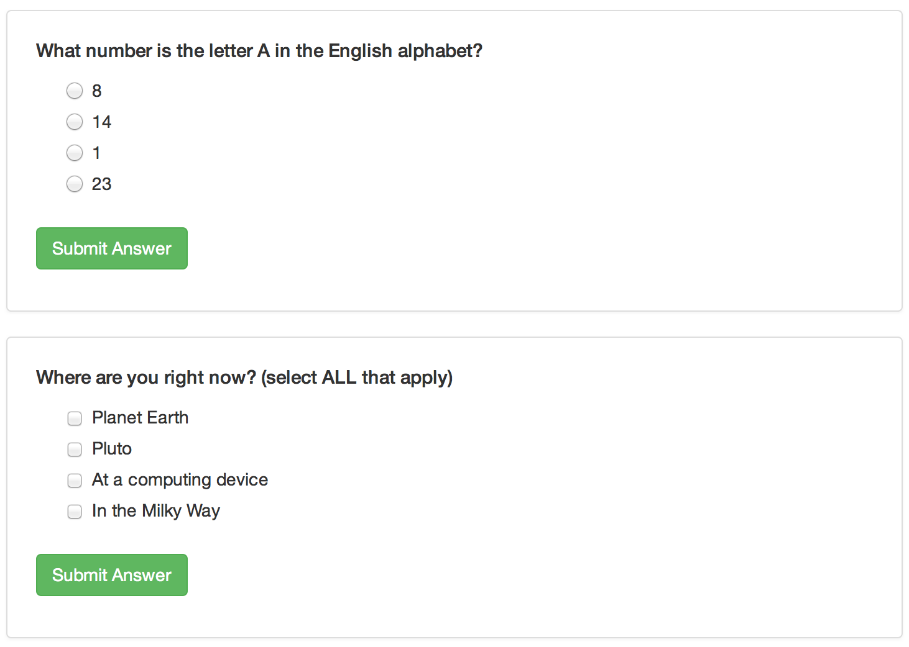
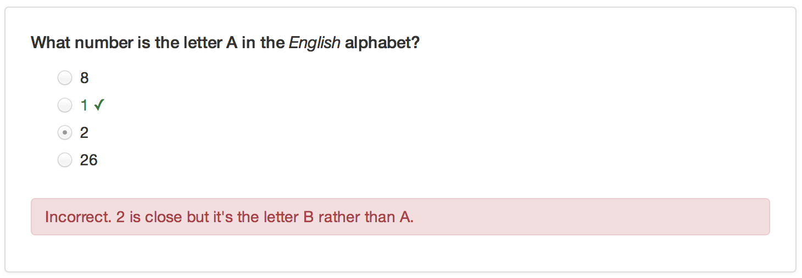
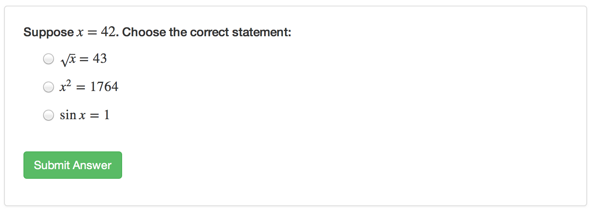

## Overview

You can include one or more multiple-choice quiz questions within a tutorial to help verify that readers understand the concepts presented.
Questions can either have a single or multiple correct answers.

Include a question by calling the `question` function within an R code chunk:

```{r snippet-question, echo = FALSE}
source("snippets.R")
insert_snippet("question")
```

The above example defines a question with a single correct answer.
You can also create questions that require multiple answers to be specified:

```{r snippet-questionmultiple, echo = FALSE}
insert_snippet("questionmultiple")
```

Note that for the examples above we specify the `echo = FALSE` option on the R code chunks that produce the questions.
This is required to ensure that the R source code for the questions is not printed within the document.

This is what the above example quiz questions would look like within a tutorial:



## Custom Messages

You can add answer-specific correct/incorrect messages using the `message` option.
For example:

```{r snippet-questionmessages, echo = FALSE}
insert_snippet("questionmessages")
```



## Formatting and Math

You can use markdown to format text within questions, answers, and custom messages.
You can also include embedded LaTeX math using the `$` delimiter.
For example:

```{r snippet-questionmath, echo = FALSE}
insert_snippet("questionmath")
```

Note the use of a double-backslash (`\\`) as the prefix for LaTeX macros.
This is necessary to "escape" the single-backslash so that R doesn't interpret it as a special character.
Here's what this example would look like within a tutorial:



## Retrying Questions

By default when an incorrect answer is provided users get the appropriate feedback and the correct answer(s) are highlighted.
You can also provide an option for the user to try the question again.
You can do this using the `allow_retry` option, for example:

```{r snippet-questionretry, echo = FALSE}
insert_snippet("questionretry")
```

## Random Answer Order

If you want the answers to questions to be randomly arranged, you can add the `random_answer_order` option.
For example:

```{r snippet-questionrandom, echo = FALSE}
insert_snippet("questionrandom")
```

## Groups of Questions

You can present a group of related questions as a quiz by wrapping your questions within the `quiz` function.
For example:

```{r snippet-questionquiz, echo = FALSE}
insert_snippet("questionquiz")
```
