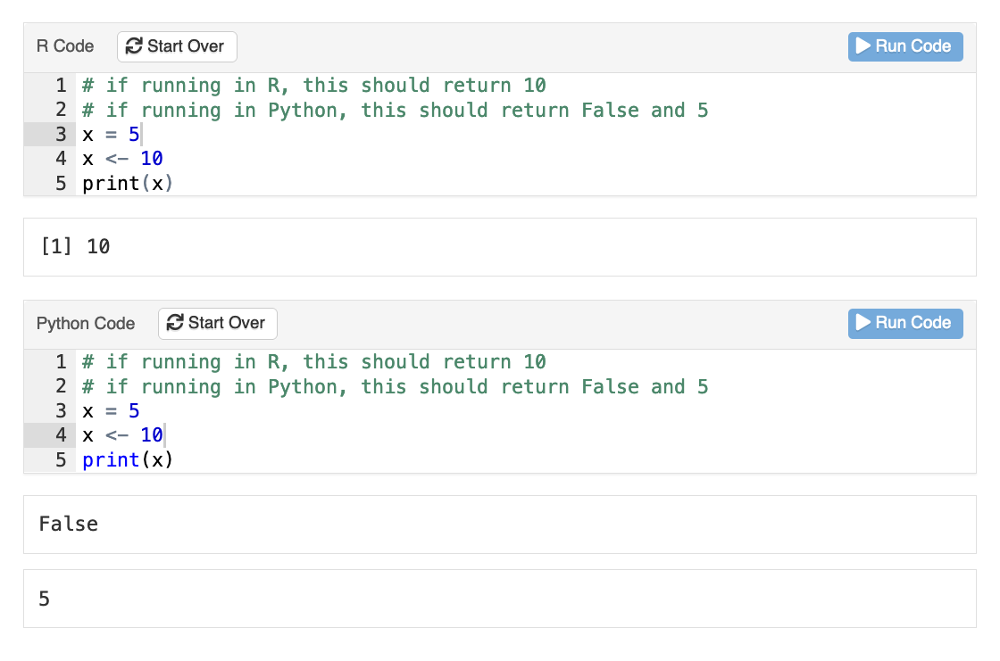
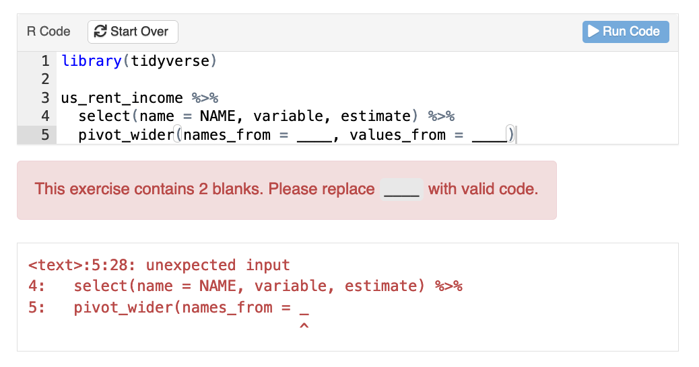
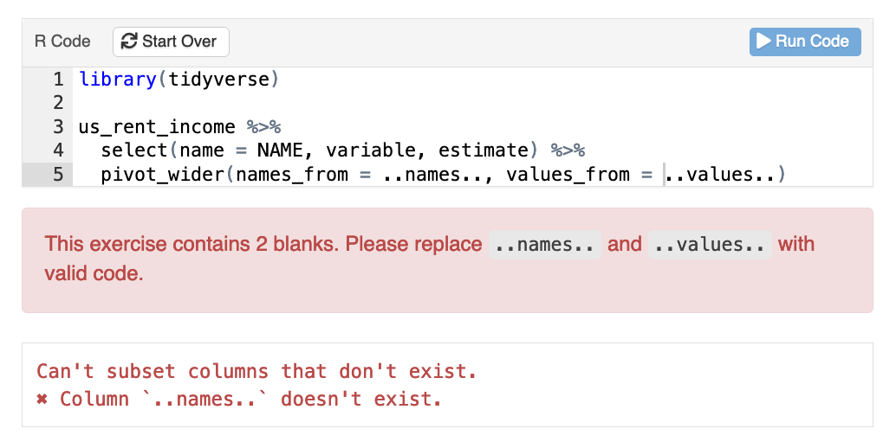
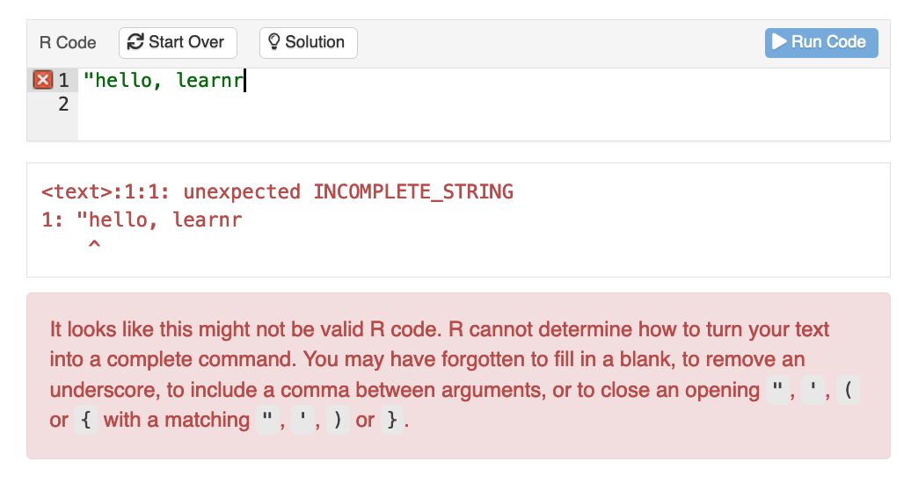
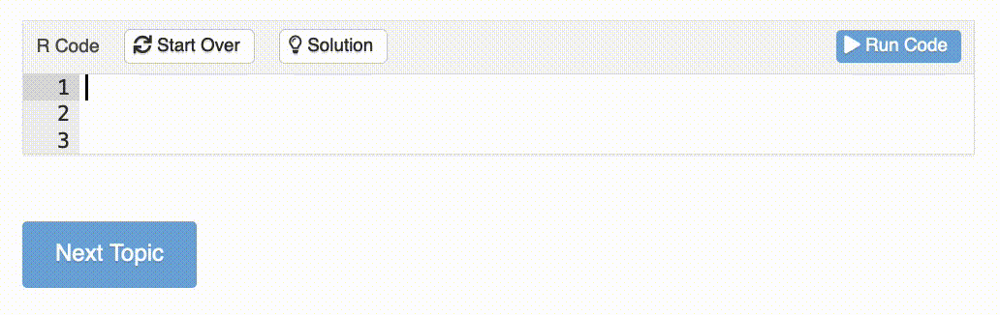
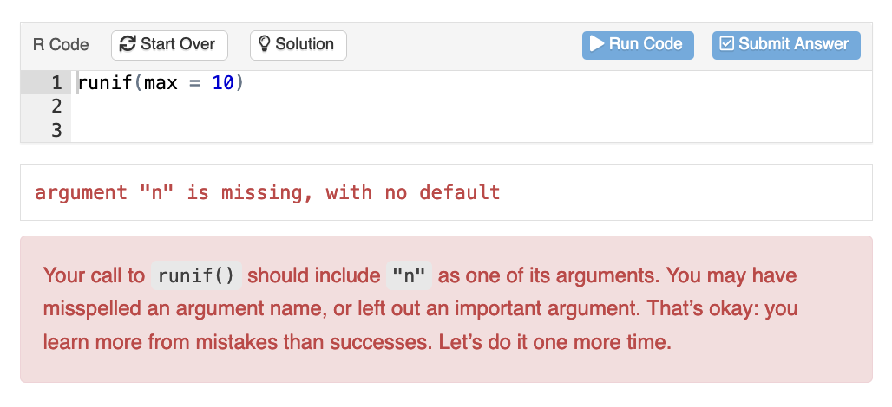
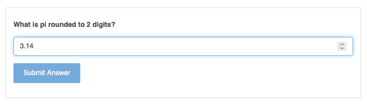

```{r, include = FALSE}
knitr::opts_chunk$set(
  collapse = TRUE,
  comment = "#>"
)
```


## Intro

We are happy to announce that version `0.11.0` of learnr has arrived at a CRAN mirror near you.
This release collects many large and small improvements to the learnr package,
all with the goal of making it easier to create interactive tutorials for teaching programming concepts and skills.

Read on for an overview of the changes in version `0.11.0`,
or review the [changelog] for a full list of updates.
Use `install.packages()` to install the latest version of learnr,
which includes demonstrations of many of the new features.

```r
install.packages("learnr")
```

## learnr speaks more than R

learnr tutorials are a great way to teach others R:
it's in the package name, after all.
And thanks to R Markdown's flexibility,
learnr is a great way to teach other programming languages as well,
using the spoken language of your choice!

### Internationalization

learnr now allows tutorial authors to choose the words or language used for learnr's UI elements
using the `language` argument of the `tutorial` format.
We are very grateful for the contributions of a number of community members
to allow learnr to include out-of-the-box support for the following languages:

```{=html}
<ul>
  <li>Basque (eu) language support was contributed by <a href="https://github.com/mikelmadina" class="external-link">Mikel Madina</a> (<a href="https://github.com/rstudio/learnr/issues/489" class="external-link">#489</a>)</li>
  <li>
    Portuguese (pt) language support was contributed by <a href="https://github.com/beatrizmilz" class="external-link">Beatriz Milz</a> (<a href="https://github.com/rstudio/learnr/issues/488" class="external-link">#488</a>,
    <a href="https://github.com/rstudio/learnr/issues/551" class="external-link">#551</a>)
  </li>
  <li>
    Spanish (es) language support was contributed by <a href="https://github.com/yabellini" class="external-link">Yanina Bellini Saibene</a> (<a href="https://github.com/rstudio/learnr/issues/483" class="external-link">#483</a>,
    <a href="https://github.com/rstudio/learnr/issues/546" class="external-link">#546</a>)
  </li>
  <li>
    Turkish (tr) language support was contributed by <a href="https://github.com/hyigit2" class="external-link">Hulya Yigit</a> and <a href="https://github.com/coatless" class="external-link">James J Balamuta</a> (
    <a href="https://github.com/rstudio/learnr/issues/493" class="external-link">#493</a>, <a href="https://github.com/rstudio/learnr/issues/554" class="external-link">#554</a>)
  </li>
  <li>
    German (de) language support was contributed by <a href="https://github.com/NinaCorrelAid" class="external-link">@NinaCorrelAid</a> (<a href="https://github.com/rstudio/learnr/issues/611" class="external-link">#611</a>,
    <a href="https://github.com/rstudio/learnr/issues/612" class="external-link">#612</a>)
  </li>
  <li>Korean (ko) language support was contributed by <a href="https://github.com/choonghyunryu" class="external-link">Choonghyun Ryu</a> (<a href="https://github.com/rstudio/learnr/issues/634" class="external-link">#634</a>)</li>
  <li>Chinese (zh) language support was contributed by <a href="https://github.com/shalom-lab" class="external-link">@shalom-lab</a> (<a href="https://github.com/rstudio/learnr/issues/681" class="external-link">#681</a>)</li>
  <li>Polish (pl) language support was contributed by <a href="https://github.com/kuba58426" class="external-link">Jakub Jędrusiak</a> (<a href="https://github.com/rstudio/learnr/issues/686" class="external-link">#686</a>)</li>
</ul>

```

You can choose one of the above via the `language` setting in your tutorial's YAML frontmatter:

```
---
output:
  learnr::tutorial:
    language: es
runtime: shinyrmd
---
````

The language chosen for the tutorial is passed to the R session used to evaluate exercise code,
so that translatable messages from R will also be presented in the specified language
(thanks [Alex Rossell Hayes](https://github.com/rossellhayes)).

In addition, you can customize the words displayed on specific UI elements using a named list.
For example, the default text used on the "Run Code" button in Spanish is *Ejecutar código*.
You can use the Spanish language translation and modify this particular translation using a named list:

```
---
output:
  learnr::tutorial:
    language: 
      es:
        button:
          runcode: Ejecutar
runtime: shinyrmd
---
````

You can learn more about internationalization features
and the full syntax for customizing the language used by learnr
in the [internationalization vignette](../multilang.html).

*We would love to support __more__ languages and would happily [welcome your contribution](../multilang.html#complete-translations).*

### Support for additional programming languages

In addition to spoken languages,
learnr is now better at running code in programming languages other than R.
The biggest improvement is for SQL exercises,
where learners can execute SQL queries on a database.
This was previously possible,
but now tutorial authors can use grading packages like [gradethis]
to grade the tables returned by the student's queries.
You can see this in action using 
`run_tutorial("sql-exercise", "learnr")`
([SQL demo online version](https://learnr-examples.shinyapps.io/sql-exercise)).

learnr also includes UI improvements in the interactive exercise component for other languages,
including syntax highlighting and basic auto-completion for exercise code
in languages such as Python, JavaScript, Julia and SQL.
Try 
`run_tutorial("polyglot", "learnr")` 
([polyglot online version](https://learnr-examples.shinyapps.io/polyglot/))
to see several programming languages in use in the same tutorial.

```{=html}

```

For exercise checking,
learnr communicates the exercise engine to exercise-checking functions
via a new `engine` argument that should be included in the exercise checker function signature.

## Exercises

Beyond expanded language support,
interactive exercises and questions in learnr tutorials
have received a number of updates and improvements.

### Setup chunk chaining

Thanks to [Nischal Shrestha](https://github.com/nischalshrestha),
exercises can now be chained together via chained setup chunks
such that the setup of one exercise may depend on other exercises[^1],
including the setup chunks of other exercises in the tutorial.
This makes it easier for the author to progressively work through a problem
with a series of interactive exercises that build on each other.

[^1]: Note that with chained setup chunks, an exercise only ever uses the code as written in the chunks in the source document. Exercises are still completely independent of each other when viewed by a user.

An exercise chunk —
an R chunk with `exercise = TRUE` —
can specify its setup chunk using the `{label}-chunk` naming convention
or with the `exercise.setup` chunk option.
Any chunk being used as a setup chunk may also include
an `execise.setup` option specifying its own parent chunk.

Try 
`run_tutorial("setup-chunks", "learnr")`
([setup-chunks online version](https://learnr-examples.shinyapps.io/setup-chunks/))
to see chained setup chunks in action.

### Catching common code issues

When teaching new programming concepts,
it can be helpful to provide learners with some scaffolding in an exercise
to focus their attention on skills they just recently learned.

For example, if you are explaining the difference between
the `names_from` and `values_from` arguments in `tidyr::pivot_wider()`,
you might want to ask students to practice using the arguments
without distracting them with writing code to set up a transformation.
It's common to use underscores or other patterns
to indicate that students should fill in a missing piece.

```r
library(tidyverse)

us_rent_income %>% 
  select(name = NAME, variable, estimate) %>%
  pivot_wider(names_from = ____, values_from = ____)
```

If students submit code containing blanks,
learnr will warn the student that they should replace the `____` with valid code.

```{=html}

```

Blanks are detected using regular expressions (since blanks may make the code unparsable),
and learnr's default pattern is to detect three or more consecutive underscores.
Authors can choose the pattern for detecting blanks with the `exercise.blanks` chunk option.
Setting `exercise.blanks = "[.]{2}[a-z]+[.]{2}"`, for example,
would allow the author to use valid R syntax for blanks.
The warning message shown to students calls out the blanks they need to fill in.

```{=html}

```

Another common problem in code involves character conversions
when a student copies code from an application with automatic formatting
and pastes the text into a learnr tutorial.
We frequently see problems with quotation marks in code samples being converted to Unicode-formatted quotation marks (curly quotes).
In general, these kinds of conversions make the R (or other language) code unparsable.
Now learnr will detect these mistakes and suggest a replacement.

```{=html}

```

Finally, if the learner submits code that isn't parsable --
and not for any of the above reasons --
learnr now returns a generic, but helpful,
feedback message
with guidance about common syntax errors.

```{=html}

```

In all of the above cases,
the actual R output,
often an error message,
is always shown to the learner.
This helps students acclimate to the error messages they would see
in their console if encountered in their every-day usage of R.

### Improved keyboard support

Keyboard navigation and shortcuts for the interactive exercise code editor has been improved.
Previously, the editor would trap keyboard focus
because the <kbd>Tab</kbd> key is used for indentation in the editor.
Now, users can press <kbd>Escape</kbd> when the editor has focus
to temporarily disable using <kbd>Tab</kbd> for indentation,
making it possible to move to the next or previous element in the tutorial.

```{=html}
<video controls width="100%">
  <source src="images/exercise-tab-example.mp4" type="video/mp4">
  
  <p class="sr-only">A demonstration of navigating through an exercise editor. At the start of the animation, the editor has focus and '2 + 2' is typed into the editor. Then the user presses the Esc key and a dark outline is applied to the editor container. Pressing Shift and Tab moves to the previous element, the 'Run Code' button in the exercise toolbar. Then the user uses Tab to move back into the editor and again presses Esc to disable indentation, followed by Tab to move out of the editor to the next focusable element in the page.</p>
</video>

```

The exercise editor also supports a few additional keyboard shortcuts:

* The (magrittr) pipe `%>%` with <kbd>Cmd</kbd> / <kbd>Ctrl</kbd> + <kbd>Shift</kbd> + <kbd>M</kbd>

* The assignment arrow, `<-` with <kbd>Opt</kbd> / <kbd>Alt</kbd> + <kbd>-</kbd>

* <kbd>Cmd</kbd> / <kbd>Ctrl</kbd> + <kbd>Enter</kbd> runs the selected code


### The `data` directory

When users submit code as part of an exercise,
learnr evaluates their code in a temporary directory
that's used just for the evaluation of their submission.
This helps ensure that every submission returns the same value,
but it makes it harder for authors to write exercises that use files,
such as `.csv` or other files,
as inputs for the user's code.

To remedy this,
thanks to work by [Alex Rossell Hayes](https://github.com/rossellhayes),
learnr now treats a `data/` directory,
stored adjacent to the tutorial,
as special.
Authors can reference files in the `data/` directory
in the static content of tutorials,
and the files are also made available for student use in the exercises.
Each exercise evaluation copies the directory into the exercise's temporary directory
so that subsequent submissions work
even if the student accidentally overwrites or deletes
the files.
In all cases,
files in `data/` can be referenced
using the same relative path,
e.g. `"data/estimates.csv"`.

### Error checking

It is now possible to provide customized feedback
when a learner's exercise submission produces an evaluation error.
The `exercise.error.checker` option of `tutorial_options()`
allows authors to define an error-checking function that is applied
when an error is thrown by a user's code.
You may also use `exercise.error.check.code` to define the default error checking code
that would normally be written in an `-error-check` chunk.

An excellent default error checker is `gradethis::gradethis_error_checker()`,
which is enabled by default if [gradethis] is loaded in a learnr tutorial.
The gradethis error checker automatically provides the student with a hint
when an error is encountered,
by comparing the submitted code with the expected solution.

```{=html}

```

## Questions

This release of learnr includes a new question type, `question_numeric()`.
The numeric question type is a complement to `question_text()`
when a numeric answer is required.

```{=html}

```

In general, question answers are specified with the `answer()` function,
but these answers can only be a single value,
which has limited applicability in text and numeric questions.

Now, authors can use `answer_fn()` to provide a single-argument function
that takes the student's submitted answer
and determines if their submission is correct.
This allows authors to check a range of values or answers at once.

## Thanks

We are hugely thankful for the 101 community members
who have contributed pull requests,
submitted translations,
or reported issues since our last release.
There are many more contributions and updates to this version of learnr
that aren't covered in this post;
be sure to check out [the full list of changes][changelog].

Thank you also to the previous maintainer of learnr, [Barrett Schloerke](https://github.com/schloerke)!
(learnr is now maintained by me, [Garrick Aden-Buie](https://github.com/gadenbuie).)

&#x1F64F; Big thank you to all of our contributors:

[&#x0040;acarzfr](https://github.com/acarzfr),
[&#x0040;acastleman](https://github.com/acastleman),
[&#x0040;adisarid](https://github.com/adisarid),
[&#x0040;agmath](https://github.com/agmath),
[&#x0040;AlbertLeeUCSF](https://github.com/AlbertLeeUCSF),
[&#x0040;andysouth](https://github.com/andysouth),
[&#x0040;annafergusson](https://github.com/annafergusson),
[&#x0040;assignUser](https://github.com/assignUser),
[&#x0040;batpigandme](https://github.com/batpigandme),
[&#x0040;bbitarello](https://github.com/bbitarello),
[&#x0040;beatrizmilz](https://github.com/beatrizmilz),
[&#x0040;bhogan-mitre](https://github.com/bhogan-mitre),
[&#x0040;bjornerstedt](https://github.com/bjornerstedt),
[&#x0040;blaiseli](https://github.com/blaiseli),
[&#x0040;Brunox13](https://github.com/Brunox13),
[&#x0040;C4caesar](https://github.com/C4caesar),
[&#x0040;caievelyn](https://github.com/caievelyn),
[&#x0040;cderv](https://github.com/cderv),
[&#x0040;chendaniely](https://github.com/chendaniely),
[&#x0040;choonghyunryu](https://github.com/choonghyunryu),
[&#x0040;chrisaberson](https://github.com/chrisaberson),
[&#x0040;coatless](https://github.com/coatless),
[&#x0040;ColinFay](https://github.com/ColinFay),
[&#x0040;cpsievert](https://github.com/cpsievert),
[&#x0040;cswclui](https://github.com/cswclui),
[&#x0040;czucca](https://github.com/czucca),
[&#x0040;davidkane9](https://github.com/davidkane9),
[&#x0040;dcossyleon](https://github.com/dcossyleon),
[&#x0040;ddauber](https://github.com/ddauber),
[&#x0040;deepanshu88](https://github.com/deepanshu88),
[&#x0040;dfailing](https://github.com/dfailing),
[&#x0040;dmenne](https://github.com/dmenne),
[&#x0040;dputhier](https://github.com/dputhier),
[&#x0040;DrAtzi](https://github.com/DrAtzi),
[&#x0040;drmowinckels](https://github.com/drmowinckels),
[&#x0040;dtkaplan](https://github.com/dtkaplan),
[&#x0040;elimillera](https://github.com/elimillera),
[&#x0040;elmstedt](https://github.com/elmstedt),
[&#x0040;emarsh25](https://github.com/emarsh25),
[&#x0040;enoches](https://github.com/enoches),
[&#x0040;ericemc3](https://github.com/ericemc3),
[&#x0040;ethelpruss](https://github.com/ethelpruss),
[&#x0040;gadenbuie](https://github.com/gadenbuie),
[&#x0040;gaelso](https://github.com/gaelso),
[&#x0040;garrettgman](https://github.com/garrettgman),
[&#x0040;gdkrmr](https://github.com/gdkrmr),
[&#x0040;gtritchie](https://github.com/gtritchie),
[&#x0040;gvwilson](https://github.com/gvwilson),
[&#x0040;helix84](https://github.com/helix84),
[&#x0040;hyigit2](https://github.com/hyigit2),
[&#x0040;ijlyttle](https://github.com/ijlyttle),
[&#x0040;indenkun](https://github.com/indenkun),
[&#x0040;jakub-jedrusiak](https://github.com/jakub-jedrusiak),
[&#x0040;jcheng5](https://github.com/jcheng5),
[&#x0040;jennybc](https://github.com/jennybc),
[&#x0040;jhk0530](https://github.com/jhk0530),
[&#x0040;joe-chelladurai](https://github.com/joe-chelladurai),
[&#x0040;johnbde](https://github.com/johnbde),
[&#x0040;jooyoungseo](https://github.com/jooyoungseo),
[&#x0040;jtelleriar](https://github.com/jtelleriar),
[&#x0040;jtransue](https://github.com/jtransue),
[&#x0040;kaisamng](https://github.com/kaisamng),
[&#x0040;KatherineCox](https://github.com/KatherineCox),
[&#x0040;kendavidn](https://github.com/kendavidn),
[&#x0040;kevinushey](https://github.com/kevinushey),
[&#x0040;lorenzwalthert](https://github.com/lorenzwalthert),
[&#x0040;ltl-manabi](https://github.com/ltl-manabi),
[&#x0040;MAGALLANESJoseManuel](https://github.com/MAGALLANESJoseManuel),
[&#x0040;MaralDorri](https://github.com/MaralDorri),
[&#x0040;markwsac](https://github.com/markwsac),
[&#x0040;MayaGans](https://github.com/MayaGans),
[&#x0040;meatballhat](https://github.com/meatballhat),
[&#x0040;mikelmadina](https://github.com/mikelmadina),
[&#x0040;mine-cetinkaya-rundel](https://github.com/mine-cetinkaya-rundel),
[&#x0040;mpjashby](https://github.com/mpjashby),
[&#x0040;mstackhouse](https://github.com/mstackhouse),
[&#x0040;mutlusun](https://github.com/mutlusun),
[&#x0040;NinaCorrelAid](https://github.com/NinaCorrelAid),
[&#x0040;nischalshrestha](https://github.com/nischalshrestha),
[&#x0040;NuoWenLei](https://github.com/NuoWenLei),
[&#x0040;petzi53](https://github.com/petzi53),
[&#x0040;plukethep](https://github.com/plukethep),
[&#x0040;profandyfield](https://github.com/profandyfield),
[&#x0040;psads-git](https://github.com/psads-git),
[&#x0040;pseudorational](https://github.com/pseudorational),
[&#x0040;RaymondBalise](https://github.com/RaymondBalise),
[&#x0040;rossellhayes](https://github.com/rossellhayes),
[&#x0040;rundel](https://github.com/rundel),
[&#x0040;schloerke](https://github.com/schloerke),
[&#x0040;shalom-lab](https://github.com/shalom-lab),
[&#x0040;shalutiwari](https://github.com/shalutiwari),
[&#x0040;siebrenf](https://github.com/siebrenf),
[&#x0040;SilasK](https://github.com/SilasK),
[&#x0040;stragu](https://github.com/stragu),
[&#x0040;themfrees](https://github.com/themfrees),
[&#x0040;tombeesley](https://github.com/tombeesley),
[&#x0040;trestletech](https://github.com/trestletech),
[&#x0040;tvedebrink](https://github.com/tvedebrink),
[&#x0040;vnijs](https://github.com/vnijs),
[&#x0040;wch](https://github.com/wch),
and [&#x0040;yabellini](https://github.com/yabellini).

[gradethis]: https://pkgs.rstudio.com/gradethis
[changelog]: ../../news/index.html#learnr-0110
